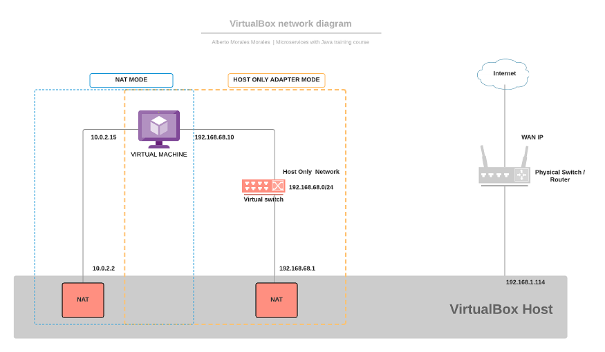

# Recomended software resources

[Open JDK](https://openjdk.java.net/install/) 8 or newer.

## Workstation (Windows)

* [VirtualBox](https://www.virtualbox.org/wiki/Downloads) (VirtualBox-5.2.34-133893-Win verified)
* [git](https://git-scm.com/downloads) (Git for Windows v2.19.0 verified)
* [gmaster](https://gmaster.io/) (gmaster git client)
* [WinSCP](https://winscp.net/eng/download.php) (WinSCP-5.15.5-Setup verified)
* [Postman](https://www.getpostman.com/) (Postman-win64-7.10.0-Setup verified)
* [pgAdmin](https://www.postgresql.org/ftp/pgadmin/pgadmin4/v4.16/windows/) (pgAdmin-v4.16 verified)
* [MobaXterm](https://mobaxterm.mobatek.net/download.html) (MobaXterm_Installer_v12.3 verified)
* [Eclipse IDE](https://www.eclipse.org/downloads/packages/release/neon/2/eclipse-ide-java-developers) (eclipse-inst-win64 verified)
* [Apache Maven](https://maven.apache.org/download.cgi) (apache-maven-3.6.2-bin verified)
* [Apache JMeter](https://jmeter.apache.org/download_jmeter.cgi) (apache-jmeter-5.2 verified)

## Server

* [PostgreSQL](https://www.postgresql.org/) (PostgreSQL 9.5.19 verified)
* [git](https://git-scm.com/downloads) (Git version 2.7.4 verified)
* [Docker](https://www.docker.com/products/container-runtime) (Docker version 17.05.0-ce, build 89658be verified)
* [Apache Kafka](https://kafka.apache.org/) (kafka_2.11-2.3.1 verified)

### VirtualBox Network

