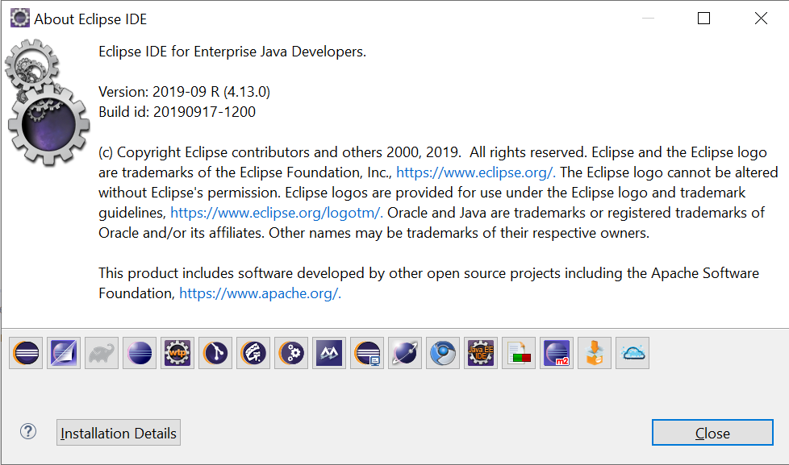
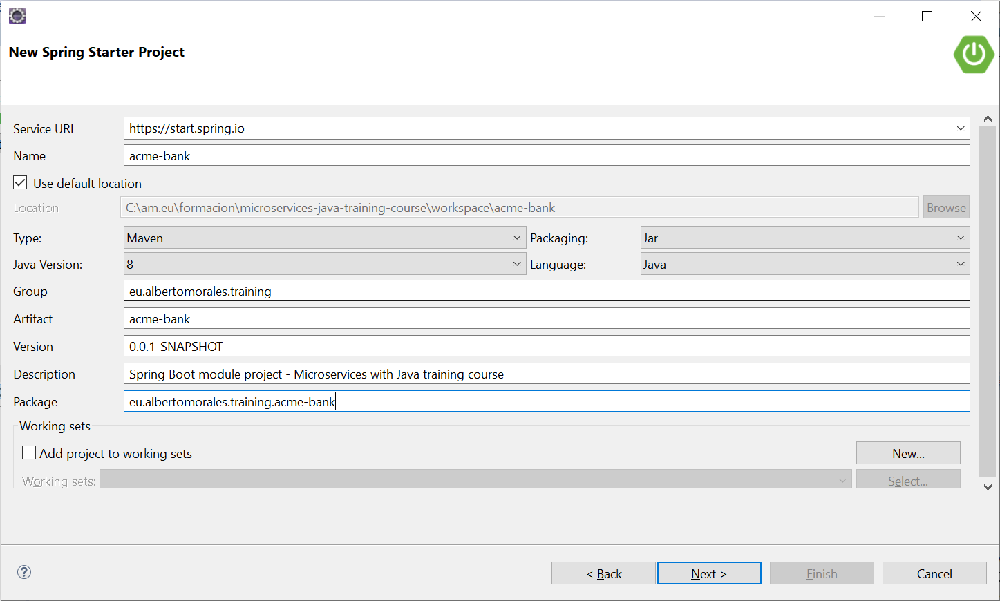
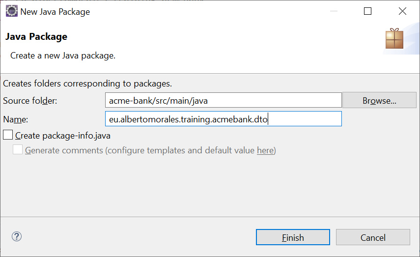
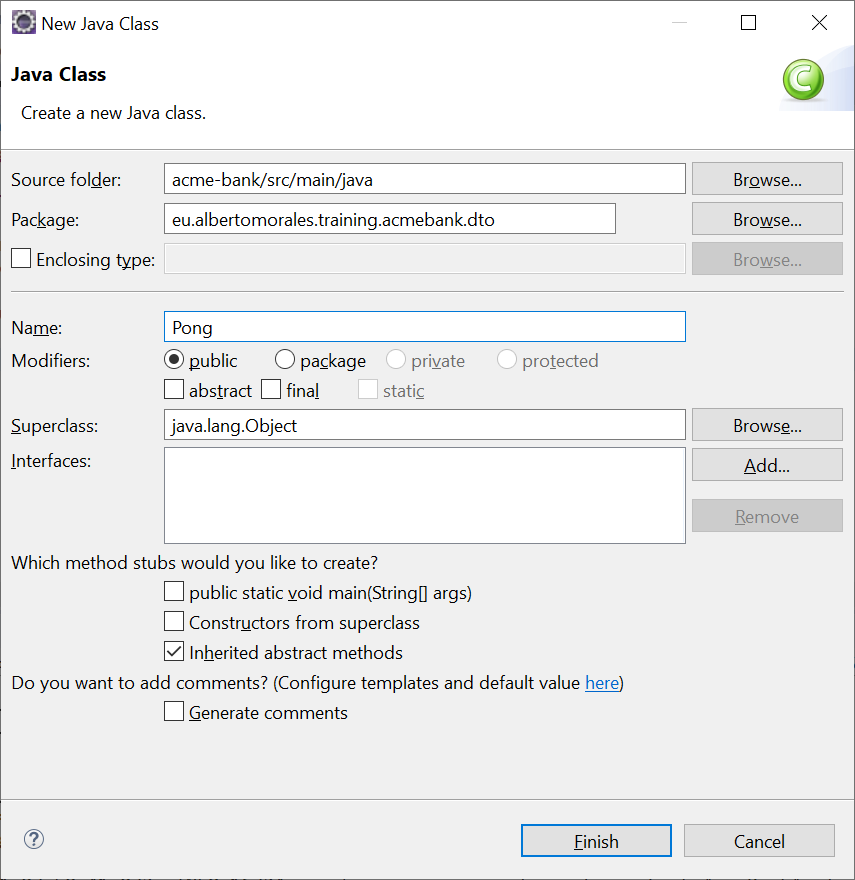
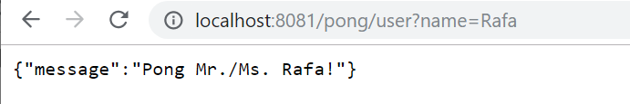

# RESTful  Web Services with Spring Boot

## Introduction

The goal of this session is to achieve full autonomy by setting up and configuring a Spring Boot application with a standard and easy configuration (but effective for most projects), as well as learn the fundamentals about REST APIs design and creation.

It is expected that upon completion of the training session, participants will be able to:

 * Create a new Spring Boot Application.
 * Make a REST endpoint to work.
 * Distinguish between the diferent ways to receive parameters.
 * Know the particularities of severals HTTP verbs, and choose between them.
 * Use different tools to invoke services (curl, Postman).

The first drill is about a simple pong service that just greets when invoked.

## Spring Boot Applications

Spring Boot is a framework that eases the development of web applications. It has a lot of pre-configured modules that eliminate the manual addition of dependencies for developing an application with Spring. This is the sole reason for this being one of the favorites for creating microservices. Let's see how to create a Spring Boot Application in a few minutes.

### Current situation and motivation for Spring Boot existance

Spring Boot Framework is not implemented from the scratch by The Spring Team, rather than implemented on top of existing Spring Framework (Spring IO Platform).
It is not used for solving any new problems. It is used to solve same problems like Spring Framework.


*Why Spring Boot?*

* To ease the Java-based applications Development, Unit Test and Integration Test Process.
* To reduce Development, Unit Test and Integration Test time by providing some defaults.
* To increase Productivity.

## Spring Boot Introduction

### Spring Boot features

*Advantages of Spring Boot:*

* It is very easy to develop Spring Based applications with Java or Groovy.
* It reduces lots of development time and increases productivity.
* It avoids writing lots of boilerplate Code, Annotations and XML Configuration.
* It is very easy to integrate Spring Boot Application with its Spring Ecosystem like Spring JDBC, Spring ORM, Spring Data, Spring Security etc.
* It follows "Opinionated Defaults Configuration" Approach to reduce Developer effort
* It provides Embedded HTTP servers like Tomcat, Jetty etc. to develop and test our web applications very easily.
* It provides CLI (Command Line Interface) tool to develop and test Spring Boot(Java or Groovy) Applications from command prompt very easily and quickly.
* It provides lots of plugins to develop and test Spring Boot Applications very easily using Build Tools like Maven and Gradle
* It provides lots of plugins to work with embedded and in-memory Databases very easily.
	        
### Main components of Spring Boot

Spring Boot Framework has mainly four major components:

* Spring Boot Starters: basically groups the related or transitive dependencies into single dependency.
* Spring Boot AutoConfigurator: the main purpose is to reduce the configurations as it was needed in Spring framework.
* Spring Boot CLI: this tool is used to run and test the Spring Boot application from command prompt.
* Spring Boot Actuator. Two major features or responsibility of this component is :
    - To provide Management EndPoints to Spring Boot Applications.
    -  Spring Boot Application Metrics. 

### Ways to create a Spring Boot project.

There are multiple approaches to create Spring Boot project. We can use any of the following approach to create application.

- Spring Starter Project Wizard
- Spring Maven Project
- Spring Initializr
- Spring Boot CLI

Here for all the units, we are using STS (Spring Tool Suite) IDE to create project. Creating project by using IDE is always a convenient way.

## Spring Boot project 

### Pre-requisites: 

- JDK
Download the latest JDK from [here](http://www.oracle.com/technetwork/java/javase/downloads/index.html). 

- IDE (Eclipse)
We recommend to follow this [guide](https://www.eclipse.org/downloads/packages/installer)
that illustrates the use of Eclipse Installer (at the current time we use Eclipse Installer 2019-09 R).



### Step 1: Spring Tools for Eclipse IDE installation

You can install the Spring Tools for Eclipse IDE into an existing Eclipse installation using the Eclipse Marketplace. Just open the marketplace client in Eclipse, search for Spring Tools and install the Spring Tools (aka Spring IDE and Spring Tool Suite)€ entry.


### Step 2. Java project setup

Once the setup of all requirements has been satisfied, a java project for the Spring Boot application must be setup.

Let's start: 

First, from the File menu select *"New"*  and then *"other"* and from wizard expand *"Spring Boot"* and select *"€˜Spring Starter Project"*€™ (*File->New->other->wizard->Spring Starter Project*)

Select next and provide the below information 



and click the Finish button.


Now you can see the below file structure in your project's explorer window.


Have a look that the AcmeBankApplication.java file which is created by the STS plug-ins.


This is a Spring Boot main class. A Spring Boot REST application loads through this class. We can also see that this class is created with the annotation `@SpringBootApplication`. As per the Spring documentation, the annotation `@SpringBootApplication` is equivalent to using `@Configuration`, `@EnableAutoConfiguration`, and `@ComponentScan`, and these annotations are frequently used together. Most of the time in Spring Boot development, the main class is always annotated with all three of these important annotations.

So we are going to modify the @SpringBootApplication anotation with a component path. Without that, the application cannot find out the controller classes. We will learn more about controller classes in a few minutes.

```java
@SpringBootApplication(scanBasePackages = {"eu.albertomorales.training.acmebank"})

public class AcmeBankApplication {
	public static void main(String[] args) {
		SpringApplication.run(AcmeBankApplication.class, args);
	}
}
```
To model the pong representation, we are going to create a resource representation class here.

First, we will create package, `com.albertomorales.training.acmebank.dto`, and add the class into that package like below:

* Right-click on the project and select New and then package. Enter the above package name and click Finish.


* Now, right click on the package `com.albertomorales.training.acmebank.dto` and select New->class and provide the class name, `Pong`, like below:


In the empty class, just copy and paste the below code:

```java
package eu.albertomorales.training.acmebank.dto;

public class Pong {

	public Pong(String message) {
		super();
		this.message = message;
	}

	public String getMessage() {
		return message;
	}
	
	private final String message;

}
```
So the above `Pong` class is a resource representation class for a pong message. Spring uses the Jackson JSON library to automatically marshal instances of type `Pong` into JSON.

Now we will introduce a controller and that will serve `Pong`. In Spring approach to building RESTful web services, HTTP requests are handled by a controller. Controller `classes/components` are easily identified by the `@RestController` annotation, and the below PongController will handle GET requests for `/pong/user` by returning a new instance of the `Pong` class.

Now just follow next steps: create the package `eu.albertomorales.training.acmebank.controller`, add the class `PongController` to it and import the class `Pong`.

```java
package eu.albertomorales.training.acmebank.controller;

import eu.albertomorales.training.acmebank.dto.Pong;
import org.springframework.stereotype.Controller;
import org.springframework.web.bind.annotation.GetMapping;
import org.springframework.web.bind.annotation.RequestParam;
import org.springframework.web.bind.annotation.ResponseBody;

@Controller

public class PongController {
	
private static final String welcomemsg = "Pong Mr. %s!";

    @GetMapping("/pong/user")
    @ResponseBody
    public Pong pongUser(@RequestParam(name="name", required=false, defaultValue="Trainee") String name) {
        return new Pong(String.format(welcomemsg, name));
    }
}
```
The `@RequestMapping` annotation maps all HTTP operations by default and, in this example, it ensures that HTTP requests to `/pong/user` are mapped to the `pongUser()` method.

Now we are done with everything for a GET RESTful call. Let's test this application first. After the test, we will learn about POST calls as well.

To compile this project with Maven, we will add the below information into the POM file:

```xml
		<dependency>
		    <groupId>org.springframework</groupId>
		    <artifactId>spring-web</artifactId>
		</dependency>
		
		<dependency>
		    <groupId>org.springframework.boot</groupId>
		    <artifactId>spring-boot-starter-web</artifactId>
		</dependency>
```
And we'll also add the below information for the property (initially to change the port number) file. 
So search for `\src\main\resources\application.properties` file and add the below lines to it.

```properties
server.port=8081 
spring.profiles.active=@spring.profiles.active@ 
```

Note: normally with Maven, you have to  have these lines in the <build> tag.

```xml
        <resources>
            <resource>
                <directory>src/main/resources</directory>
                <filtering>true</filtering>
            </resource>
        </resources>
```

But you do not need this here because Spring Boot will take care it.

Then run this to start. You should see something like this:


Once the server starts successfully, open your browser and put the below URL in the address bar and press enter.

`http://localhost:8081/pong/user?name=Rafa`

 Now you can see the below information:



If you would like to receive name as "path param" (instead of "query param") your code must change slightly:
```java
@Controller
public class PongController {
	
private static final String pongMsg = "Pong Mr./Ms. %s!";

    @GetMapping("/pong/{name}")
    @RequestMapping(value={"/pong/{name}","/pong"}, method=RequestMethod.GET)    
    @ResponseBody
    public ResponseEntity<Pong> pongUser(@PathVariable(name = "name", required = false) String name) {
        String username = StringUtils.isEmpty(name) ? "Trainee" : name;
        return ResponseEntity.ok().body(new Pong(String.format(pongMsg, username)));    	
    }
}
```
When would you use `@PathVariable` vs `@QueryParam`? This is a "best practices" or convention question.
REST may not be a standard as such, but reading up on general REST documentation and blog posts should give you some guidelines for a good way to structure API URLs. Most rest APIs tend to only have resource names and resource IDs in the path. Such as:

```URL
/departments/{dept}/employees/{id}
```

Some REST APIs use query strings for filtering, pagination and sorting, but Since REST isn't a strict standard I'd recommend checking some REST APIs out there such as github and stackoverflow and see what could work well for your use case.

I'd recommend putting any required parameters in the path, and any optional parameters should certainly be query string parameters. Putting optional parameters in the path will end up getting really messy when trying to write URL handlers that match different combinations.

	
## Bibliography


RESTful Web Services is a 2007 book by Leonard Richardson and Sam Ruby. It was the first book-length treatment of RESTful design, and the predecessor to RESTful Web APIs. RESTful Web APIs (2013) was designed as a complete replacement for RESTful Web Services.
