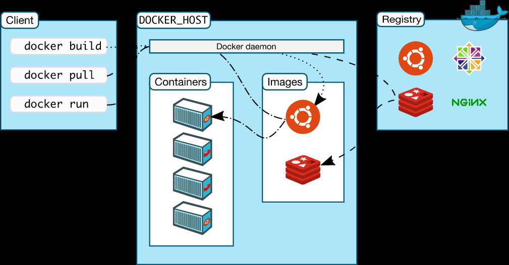
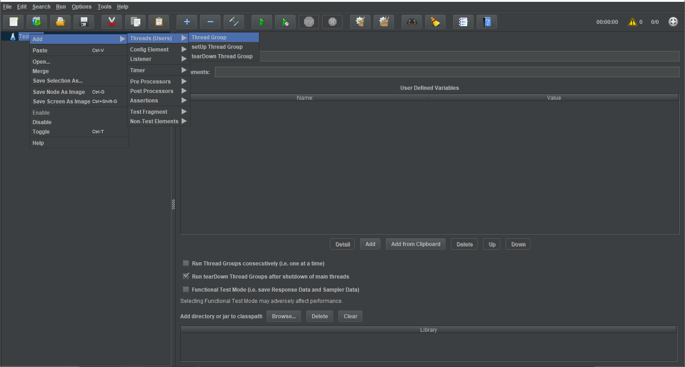
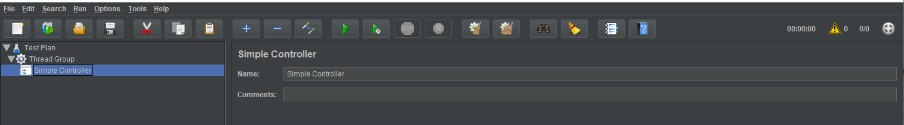
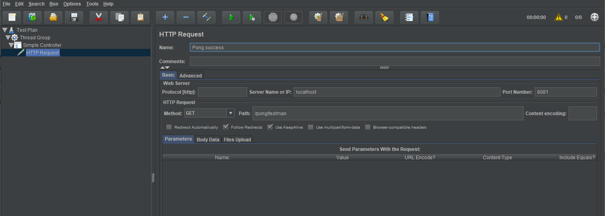
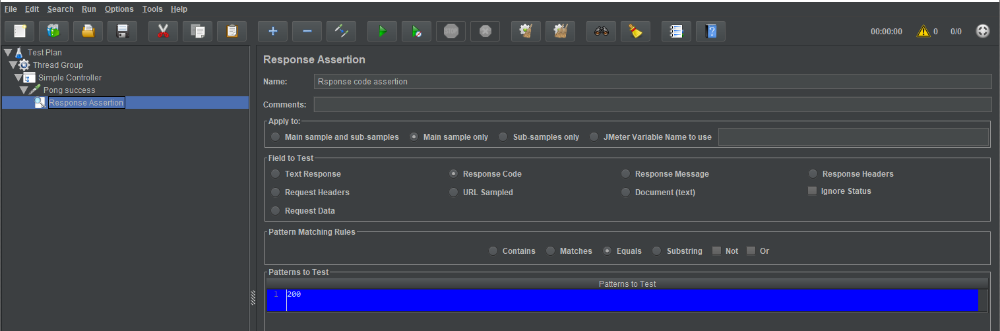
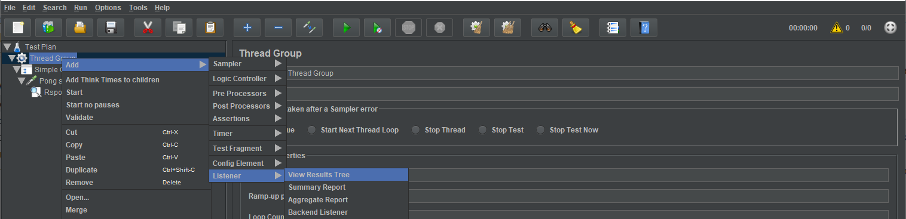
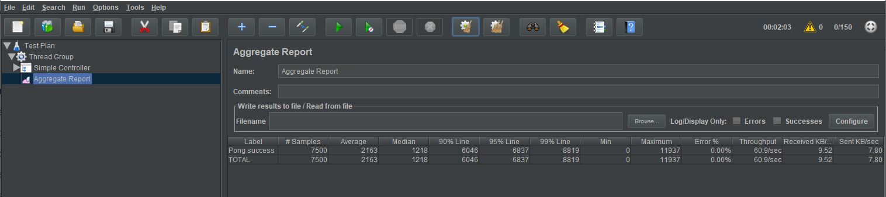

# Package, deploy and test Spring Boot Applications

## Introduction

The goal of this session is for attendees to have all the tools to start using Docker in their day to day work, for services deployment.

API Testing using Apache JMeter testing framework would serve as a bonus track for this training session.
 
We have provided a virtual machine with Docker installed. If you are curious about the installation process, you can get a glimpse of the following link forehand:
 [How to install docker on Ubuntu ](https://medium.com/@Grigorkh/how-to-install-docker-on-ubuntu-16-04-3f509070d29c)
 
**We kept the technical requirements to a minimum.** In our case we focused on having a minimal (VirtualBox) VM with Docker/Git working configuration. This will be enough to remove 80% of the blockers during the training sessions.


## Docker containers

### Current situation and motivation for Docker

Docker is currently a hot topic in container-based deployment, whereas Spring Boot is the same for microservice development. Both Spring Boot and Docker together form a great combo for developing microservice-based applications.


## Docker Introduction

Docker is an open platform for developing, shipping, and running applications. Docker enables you to separate your applications from your infrastructure so you can deliver software quickly. 

### Docker features

Docker gives the user the capability to create their own Docker images and deploy them in Docker. To create your own Docker image, you have to create your own Dockerfile. Basically, a Dockerfile is a simple text file with all the instructions required to build the image.

Docker provides tooling and a platform to manage the lifecycle of your containers:

* Develop your application and its supporting components using containers.
* The container becomes the unit for distributing and testing your application.
* When you're ready, deploy your application into your production environment, as a container or an orchestrated service. This works the same whether your production environment is a local data center, a cloud provider, or a hybrid of the two.

     
### Docker architecture
     
Docker uses a client-server architecture. The Docker client talks to the Docker daemon, which does the heavy lifting of building, running, and distributing your Docker containers. The Docker client and daemon can run on the same system, or you can connect a Docker client to a remote Docker daemon. The Docker client and daemon communicate using a REST API, over UNIX sockets or a network interface. 


        
### Main components of Docker Engine

Docker Engine is a client-server application with these major components:

* A server which is a type of long-running program called a daemon process (the dockerd command).

* A REST API which specifies interfaces that programs can use to talk to the daemon and instruct it what to do.

* A command line interface (CLI) client (the docker command).
 
### Ways to deploy a Spring Boot Application.

Spring Boot applications can be deployed into production systems with several methods:

-   Deploying in Java Archive (JAR) as a standalone application.
-   Deploying in Docker Container.
-   Deploying as Web Application Archive (WAR) into a servlet container.
-   Deploying behind NGINX web server - direct setup,
-   Deploying behind NGINX web server - containerized setup.
-   .. Kubernetes ... Open Shift ... Cloud...

In this session, we will go through step by step deployment of Spring Boot applications via the first 2 methods.

## Spring Boot Maven plugin + Docker 

We have successfully created and run the application in the embedded server of the IDE, but now we will deploy it in a Docker container. For this, we have to create a Dockerfile that will contain the steps to be executed by Docker to create an image of this application and run that image from Docker.

### Pre-requisites: 

- RESTful Web Services, persistence and entity classes [session](https://github.com/alberto-morales/microservices-java-training-course/blob/20191101-AcmeBankApplication/docs/Spring_Boot_data_JPA_PostgreSQL_REST_API.md) finished.
-  A minimal (VirtualBox) VM with Docker/Git working configuration.

### Step 1: Deploying in Java Archive (JAR) as a standalone application.

Spring Boot applications can easily be packaged into JAR files and deployed as standalone applications. 
First you set up a basic build script. You can use any build system you like when building apps with Spring, but the code you need to work with [Maven](https://maven.apache.org/) is included here. If you are not familiar with Maven, refer to [Building Java Projects with Maven](https://spring.io/guides/gs/maven). This is done by the *spring-boot-maven-plugin*. The plugin is automatically added to *pom.xml* once the Spring project is created via  [Spring Initializr](https://start.spring.io/) as a Maven project.

```xml
...
	<build>
		<plugins>
			<plugin>
				<groupId>org.springframework.boot</groupId>
				<artifactId>spring-boot-maven-plugin</artifactId>
			</plugin>
		</plugins>
	</build>

</project>

```

The [Spring Boot Maven plugin](https://docs.spring.io/spring-boot/docs/current/maven-plugin) provides many convenient features:

- It collects all the jars on the classpath and builds a single, runnable "Uber-jar", which makes it more convenient to execute and transport your service. 
    
- It searches for the *public static void main()* method to flag as a runnable class.
    
- It provides a built-in dependency resolver that sets the version number to match [Spring Boot Dependencies](https://github.com/spring-projects/spring-boot/blob/master/spring-boot-project/spring-boot-dependencies/pom.xml). You can override any version you wish, but it will default to Boot chosen set of versions.

Since 'jar' is the default packaging type it is not required to set it in this case.

```xml
<project>
   ...
  <!-- <packaging>jar</packaging>  -->
</project>
```

In order to package the application in a single (fat) jar file, run the maven command `mvn package` under project directory. This will package the application inside an executable jar file with all its dependencies

The *package* phase is always responsible for bundling all the files in the artifact, in this case a JAR-file.
In your project's target directory you'll see the generated jar file which is named like: 'acme-bank-0.0.1-SNAPSHOT.jar'.
The resulting *jar* file contains the compiled java class files as well as the files from src/main/resources.
To run the jar file, use the following standard JVM command `java -jar <jar-file-name>.jar` (in our case `java -jar acme-bank-0.0.1-SNAPSHOT.jar`).


### Step 2. Deploying in Docker Container

Before deploying the application into a Docker container, we will first package the application in a (fat) JAR file. This process is previously explained, therefore we will assume you have a jar file.

**Building the Docker image**

On the first step, we need to build a container image. For this, we start with creating a *Dockerfile* in the project root directory as follows:

```file	 
FROM openjdk:oracle   

VOLUME /tmp

COPY target/acme-bank-0.0.1-SNAPSHOT.jar app/acme-bank.jar   

EXPOSE 8081  

CMD ["java", "-jar", "app/acme-bank.jar"]
```
These are the five steps for that will create an image of our Java application to be able to run Docker.

Note that, in the above snippet, we assumed that the application JAR file `acme-bank-0.0.1-SNAPSHOT.jar`  is located under the target directory of our project. We also assumed that the embedded servlet port is 8081.

We added a VOLUME pointing to "/tmp" because that is where a Spring Boot application creates working directories for Tomcat by default. The effect is to create a temporary file on your host under "/var/lib/docker" and link it to the container under "/tmp". This step is optional for the simple app that we wrote here, but can be necessary for other Spring Boot applications if they need to actually write in the filesystem.

Before proceeding further, verify you can run docker commands from the shell.

We can now build the Docker image with the following command (from where the Dockerfile is located):

`docker image build . -t acme-bank:latest`

where  `-t`  is the name and tag of the image to be built. 

**Running the Docker image**

Once the image is built, we can create and run the container via:

`docker container run -p 8081:8081 -d --name acme-bank-container acme-bank`

where  `-p`  publishes (maps) host port to container port (in this case both are 8081). The option  `-d`  (detach) runs the container in background, and  `--name`  specifies the name of the container.


**Pushing the docker image to docker hub**

Now let's push the docker image to docker hub so that other people can download and consume our image.

Login with your Docker Id:

```shell
$ docker login
Login with your Docker ID to push and pull images from Docker Hub. If you don't have a Docker ID, head over to https://hub.docker.com to create one.
Username (morales4dev): morales4dev
Password:
Login Succeeded
```

Tag the image:

To push a local image to docker registry, you need to associate the local image with a repository on the docker registry. The notation for the repository on docker registry is username/repository:tag.

To tag an image, we use the docker tag command:

`$ docker tag image username/repository:tag`

Push the image to docker hub:

Finally, use the docker push command to push the tagged image to docker hub .

## API testing using JMeter

As a bonus track, we show the basics of creating performance tests for Spring Boot applications using JMeter. 

JMeter is one of the most popular performance testing tools in the industry. 
With this software you can perform load test, performance-oriented business (functional) test, regression test, etc., on different protocols or technologies.

Step 1 : Create new test plan —>Right click—> Add —>Threads—> Thread group



1. Set the number of threads (users) to 150 – We will have 150 users executing the test plan.
2. Set the Ramp-up period (in seconds) to 1 – The Ramp-up period tells JMeter about the length of delay before dealing with the next user.
3. Set the Loop count to 50 – number of times to execute the test.

Step 2: Thread group —>Right click —>Add —>Logic controller —> Simple controller



Simple controllers are just containers for user requests.

Step 3 : Simple controller—> Right click —>Add—>Sampler — >Http  Sampler Request



Create a GET method request, and rename it as “Pong success”.

Stemp 4: Pong success—> Right click —>Add—>Assertion — >Response Assertion




In response assertion add patterns to be tested, and rename it as "Response code assertion"

Step 5 : Threadgroup–>Add–>Listener–> Aggregate report



Step6: Save and run the Pong success testcase.



There are various reports available in JMeter. We can use them based on the project needs.

## Summary

The Spring Boot Application is running from the Docker container. Spring Boot App runs on port 8081 inside the container by default and we mapped that to the same port on the host using "-p" on the command line.

The application that we dockerized in this unit is very simple. It doesn't use any database or communicate with other services. In the next unit, you'll learn how to set up a complex service with a database.

