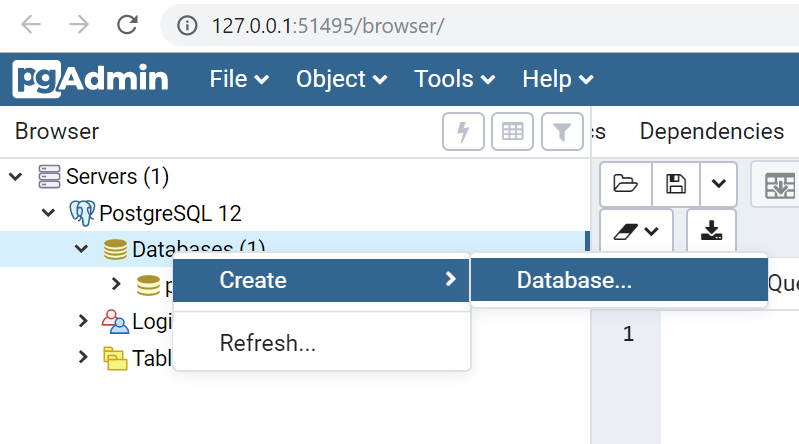
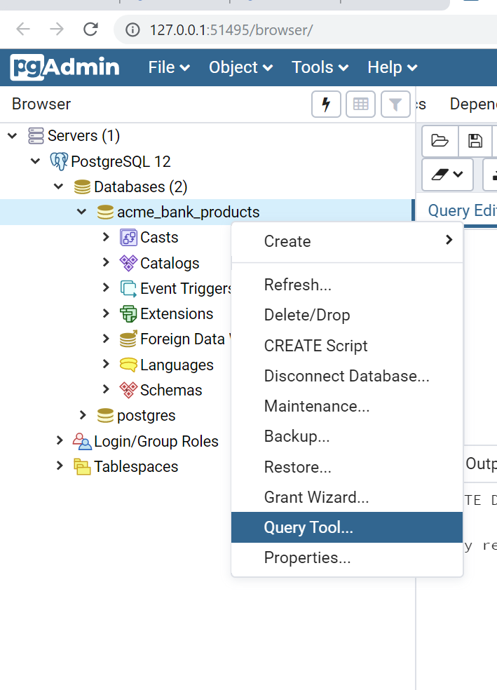
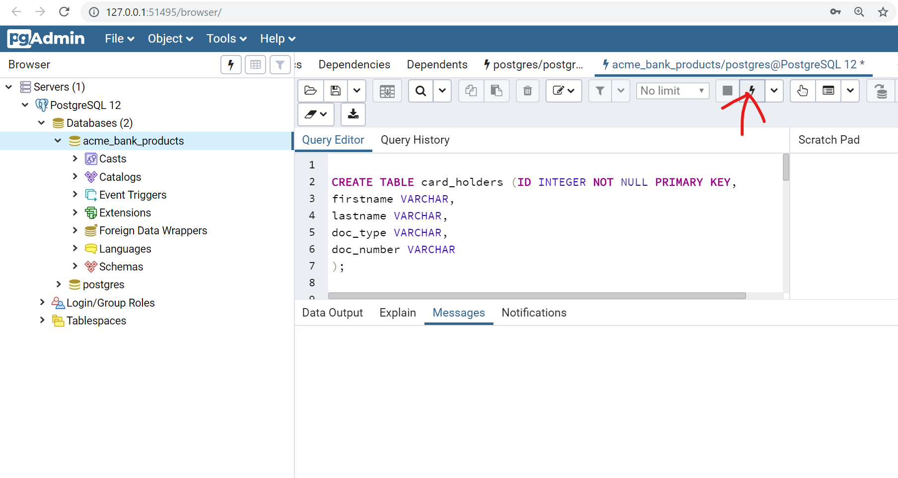
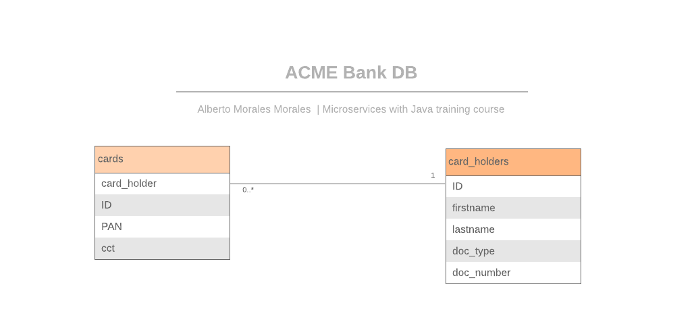
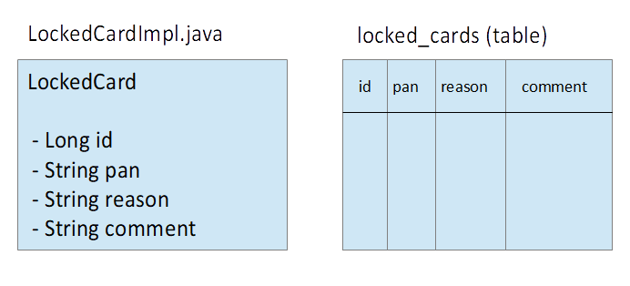
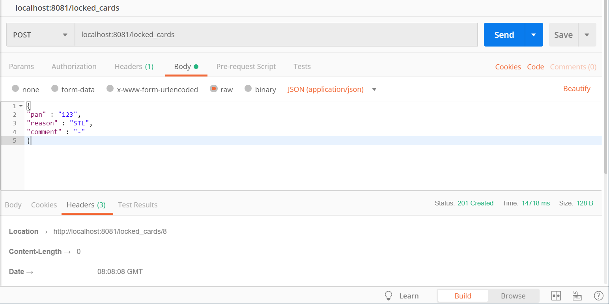

# RESTful  Web Services, persistence and entity classes

## Introduction

The goal of this session is to provide you full autonomy exposing RESTful services with Spring Boot, Spring data and JPA, accessing data stored in a relational database.

This case study is the creation of a service that, using data stored in a relational database, can give information about a Bank Entity - called ACME Bank - customers (CardsHolders and Issued Cards, will be available through different endpoints).

## Spring Boot + Spring data JPA + PostgreSQL project 

### Pre-requisites: 

- RESTful  Web Services with Spring Boot [session](https://github.com/alberto-morales/microservices-java-training-course/blob/20191101-AcmeBankApplication/docs/RESTFul-Web-Service-Spring-Boot.md) finished.

- SGBD (PostgreSQL) installed. PostgreSQL is already installed in the provided VM, but it you feel better using Windows version, you can intall it by yourself. In this case, We recommend to follow this [guide](http://www.postgresqltutorial.com/install-postgresql/) that illustrates the PostgreSQL installation proccess (at the current time we use PostgreSQL 12).

### Step 1: PostgreSQL admin tool

As with every SBBD, we need a GUI tool for manipulating, visualizing and sharing the data living in Postgres server.

For this training course we are using pgAdmin, which  is the most popular Open Source administration and development platform for PostgreSQL.


This is how the main pgAdmin UI looks like:


It allows you run queries as well as explore and examine your server and databases. The URL to access pgAdmin is

`http://127.0.0.1:51495/browser/`

### Step 2. ACME Bank database setup

Once the setup of all requirements has been satisfied, a database that supports features for the ACME Bank application must be setup.

Let's start. First of all, create a new database.

 In the Object Tree, right click and select create a database.



 In the pop-up, enter database name and encoding (optional). Finally Click Save.


DB is created and shown in the Object tree. In the Object tree, right click and select Query Tool to open a new query tool panel conected to de recently created database.



Open the file schema.sql located in `workspace\acme-bank\src\site\docs` folder, and "run" its content inside the new query tool panel.



Database ERD shown below:



### Step 3. Dependencies

Before adding some persistence code to the project, first you have to add the required dependencies to `pom.xml`. Adding spring-boot-starter-data-jpa dependency to `pom.xml` is needed, and provides transitively Spring data, Hibernate, HikariCP and related dependencies.

```xml
		<dependency>
			<groupId>org.springframework.boot</groupId>
			<artifactId>spring-boot-starter-data-jpa</artifactId>
		</dependency>
```

We must add PostgreSQL database dependency too.

```xml
	<dependency>
		<groupId>org.postgresql</groupId>
		<artifactId>postgresql</artifactId>
	</dependency>
```

### Step 4. Persistent Entity
Using JPA, you can designate any POJO class as a JPA entity – a Java object whose nontransient fields should be persisted to a relational database. The JPA Entity is any Java POJO, which can represent the underlying table structure. As our service is based on the `card_holders` table, we will create a `CardHolder` Entity object, as the following listing (in `src / main / java / eu / albertomorales / training / acmebank / persistence / impl / CardHolderImpl.java`) shows:

```java
@Entity
@Table(name = "card_holders")
public class CardHolderImpl implements CardHolder {

    public CardHolderImpl() {
    }

    public CardHolderImpl(String firstName, String lastName, String docType, String docNumber) {
		super();
		this.firstName = firstName;
		this.lastName = lastName;
		this.docType = docType;
		this.docNumber = docNumber;
	}

	@Override
	public Long getId() {
		return id;
	}
	public void setId(Long id) {
		this.id = id;
	}
	@Override
	public String getFirstName() {
		return firstName;
	}
	public void setFirstName(String firstName) {
		this.firstName = firstName;
	}
...
...
	public void setDocNumber(String docNumber) {
		this.docNumber = docNumber;
	}
    
    @Id
    @GeneratedValue(strategy = GenerationType.AUTO)
    private Long id;
    @Column(name = "firstname")    
	private String firstName;
	
...
```
The above POJO is annotated with `@Entity`, which is to denote this is an entity object for the table name `card_holders`.

Then, there are five fields that represent the datable table columns. Field `id` is our Primary Key and, hence, marked as `@Id`.

The field id is also marked with `@GeneratedValue`, which denotes that this is an Auto-Increment column and Hibernate will take care of putting in the next value. Hibernate will first query the underlying table to know the max value of the column and increment it with next insert. This also means that we don't need to specify any value for the Id column and can leave it blank.

### Step 5. Repository interface
The Repository represents the DAO layer, which typically does all the database operations. Its very simple,  thanks to Spring Data, who provides the implementations for these methods. 

Declare an interface extending `CrudRepository` (subinterface of `Repository`) and type it to the domain class and ID type that it should handle.

```java
interface CardHolderRepository extends CrudREpository <CardHolder, Long> { … }.
```

And we have declared an aditional query method on the interface.

Let's have a look at our `CardHolderRepoisitory`:

```java
import org.springframework.data.repository.CrudRepository;
import org.springframework.data.jpa.repository.Query;
import org.springframework.data.repository.query.Param;

import eu.albertomorales.training.acmebank.persistence.impl.CardHolderImpl;

import java.util.List;

public interface CardHolderRepository extends CrudRepository<CardHolderImpl, Long> {

	@Query("SELECT c FROM CardHolderImpl c WHERE c.docType = :doc_type AND c.docNumber = :doc_number ")
	List<CardHolderImpl> findByDocument(@Param("doc_type") String docType, @Param("doc_number") String docNumber);
    
}
```

Here, we are done with the JPA and Spring data things, in other words, the DAO layer. 

One more thing, update the PostgreSQL and hibernate settings in application.properties

```properties
## PostgreSQL
spring.datasource.url=jdbc:postgresql://localhost:5432/acme_bank_products
spring.datasource.username=acme
spring.datasource.password=acme

# Show or not log for each sql query
spring.jpa.show-sql = true

# Allows Hibernate to generate SQL optimized for a particular DBMS
spring.jpa.properties.hibernate.dialect = org.hibernate.dialect.PostgreSQLDialect

spring.jpa.hibernate.naming.implicit-strategy=org.hibernate.boot.model.naming.ImplicitNamingStrategyLegacyJpaImpl
spring.jpa.hibernate.naming.physical-strategy=org.hibernate.boot.model.naming.PhysicalNamingStrategyStandardImpl
```
Let's now write a Controller.

### Step 6. CardHolder Controller
The `CardHolderController` is a standard REST controller with some simple endpoints. The job of the controller is to handle the HTTP requests. Of course a service layer is needed, and the controller should invoke the Service class methods.... However, that is a different matter, for today this is good enough.

```java
import org.springframework.beans.factory.annotation.Autowired;
import org.springframework.http.HttpStatus;
import org.springframework.stereotype.Controller;
import org.springframework.web.bind.annotation.RequestMapping;
import org.springframework.web.bind.annotation.RequestMethod;
import org.springframework.web.bind.annotation.RequestParam;
import org.springframework.web.bind.annotation.PathVariable;
import org.springframework.web.bind.annotation.ResponseBody;
import org.springframework.web.server.ResponseStatusException;

import java.util.List;
import java.util.Optional;
import java.util.ArrayList;

import eu.albertomorales.training.acmebank.persistence.CardHolder;
import eu.albertomorales.training.acmebank.persistence.impl.CardHolderImpl;
import eu.albertomorales.training.acmebank.persistence.CardHolderRepository;

@Controller
public class CardHolderController {
	
	@RequestMapping(value="/customers", method = RequestMethod.GET)
    @ResponseBody
    public List<CardHolder> getByDocument(@RequestParam(required = false, name="doctype") String typeDoc, @RequestParam(required = false, name="docnumber") String numberDoc) {
		Iterable<CardHolderImpl> customers = null;
		if (typeDoc != null || numberDoc != null) {
			customers = repository.findByDocument(typeDoc, numberDoc);
		} else {
			customers = repository.findAll();
		}
    	List<CardHolder> result = new ArrayList<CardHolder>();
    	customers.forEach(result::add);
    	return result;		
    }	
	
	@RequestMapping(value="/customers/{id}", method = RequestMethod.GET)
    @ResponseBody
    public CardHolder getById(@PathVariable Long id) {
    	Optional<CardHolderImpl> optCustomer = repository.findById(id);
    	if (optCustomer.isPresent()) {
    		return (CardHolder)optCustomer.get();
    	} else {
    		throw new ResponseStatusException(
  				  HttpStatus.NOT_FOUND, "Card holder not found."
  				);
    	}
    }		
	
	@Autowired
	private CardHolderRepository repository;	
```

Now, the RESTful Service is ready to run. Start the application and execute the HTTP endpoints, that's it.


## Handling POST Requests

In the last unit, you added logic to the API for `GET` requests, which retrieved data from the database. In this one, you will add logic to handle `POST` requests on the `LockedCards` endpoint.

### Step 1: New ACME Net application setup
New features belong to a new Spring Boot application, so the first step is to set up a new database and a new Java Project.

### Step 2: Adding the routing logic
HTTP `POST` requests are used to create new resources (locked cards, in this case). The basic idea is to pull data out of the HTTP request body and use it to create a new row in the database. Let's create a new LockedCardController.java file and append the code that follows:

```java
import org.springframework.beans.factory.annotation.Autowired;
import org.springframework.stereotype.Controller;
import org.springframework.web.bind.annotation.RequestMapping;
import org.springframework.web.bind.annotation.RequestMethod;
import org.springframework.web.bind.annotation.RequestParam;
import org.springframework.web.bind.annotation.PathVariable;
import org.springframework.web.bind.annotation.RequestBody;
import org.springframework.web.bind.annotation.ResponseBody;
import org.springframework.web.server.ResponseStatusException;
import org.springframework.http.HttpStatus;
import org.springframework.http.ResponseEntity;
import org.springframework.web.servlet.support.ServletUriComponentsBuilder;

import java.net.URI;

import java.util.List;
import java.util.Optional;
import java.util.ArrayList;

import eu.albertomorales.training.acmenet.persistence.impl.LockedCardImpl;
import eu.albertomorales.training.acmenet.dto.LockedCardDTO;
import eu.albertomorales.training.acmenet.persistence.LockedCard;
import eu.albertomorales.training.acmenet.persistence.LockedCardRepository;

@Controller
public class LockedCardController {
	
...
	
	@RequestMapping(value="/locked_cards", consumes = "application/json", produces = "application/json", method = RequestMethod.POST)
    @ResponseBody
    public ResponseEntity<Object> save(@RequestBody LockedCardDTO dto) {
    	LockedCardImpl entity = new LockedCardImpl(null, 
    			                                   dto.getPan(),
    			                                   dto.getReason(),
    			                                   dto.getComment());
		entity = repository.save(entity);
        //Create resource location
        URI location = ServletUriComponentsBuilder.fromCurrentRequest()
                                    .path("/{id}")
                                    .buildAndExpand(entity.getId())
                                    .toUri();
         
        
        //Send location in response
        return ResponseEntity.created(location).build();
    }	
	
...
    
	@Autowired
	private LockedCardRepository repository;	

}
```

The LockedCardController save method function is to save "locked cards" items. Therefore, we need to have a locked card class, containing the entity properties. These properties should correspond to the columns in the "*locked_cards* table".



You must create the database table and the entity + repository Java classes,  as described in the last unit.

The POST requests can contain a payload known as "request body". The payload contains the data that could be stored or updated. The payload is usually in JSON format.

Notice that the method responsible for handling HTTP POST requests needs to be annotated with @PostMapping (or RequestMapping + method = POST) annotation.

To be able to convert the JSON sent as HTTP Body content into a Java object which we can use in our application we need to use the @RequestBody annotation for the method argument. Notice how the @RequestBody annotation is used to mark the method argument object into which the JSON document will be converted by Spring Framework.

To make your method annotated with @PostMapping be able to accept @RequestBody in JSON and XML using the following annotation:

```java
@PostMapping(
        consumes = {MediaType.APPLICATION_JSON_VALUE, MediaType.APPLICATION_XML_VALUE}
)
```
If you want your Web Service Endpoint to be able to respond with JSON or XML, then update your @PostMapping annotation to this one:

```java
@PostMapping(
        consumes = {MediaType.APPLICATION_JSON_VALUE, MediaType.APPLICATION_XML_VALUE}
        produces = {MediaType.APPLICATION_JSON_VALUE, MediaType.APPLICATION_XML_VALUE}
)
```
and to make your Web Service Endpoint respond with XML, provide the below Accept HTTP Header in the Request:

```postman
accept: application/xml
```
If you have followed all steps, the RESTful Service is ready to run. Start the application and execute the new HTTP endpoints — that's it.




## Summary

Congratulations! You have developed a Spring Boot application with a RESTful front end and a JPA-based back end.
If you want to improve your REST APIs design skills, you can check [this](https://restfulapi.net/) out ( or [this](https://www.vinaysahni.com/best-practices-for-a-pragmatic-restful-api) )
