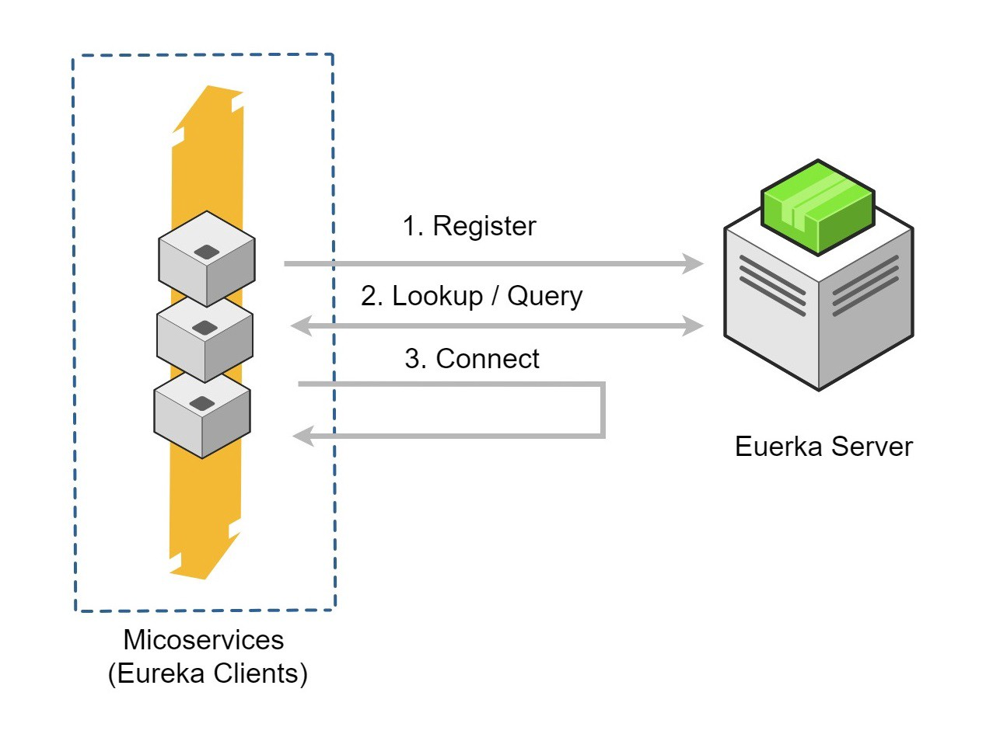
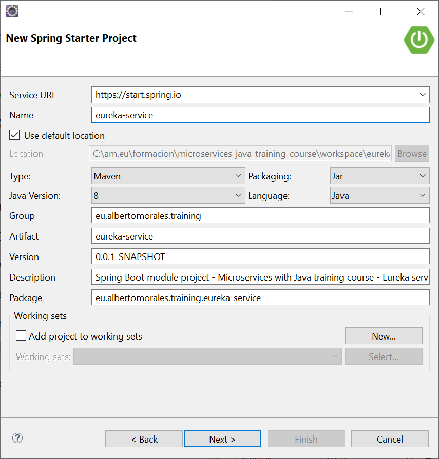
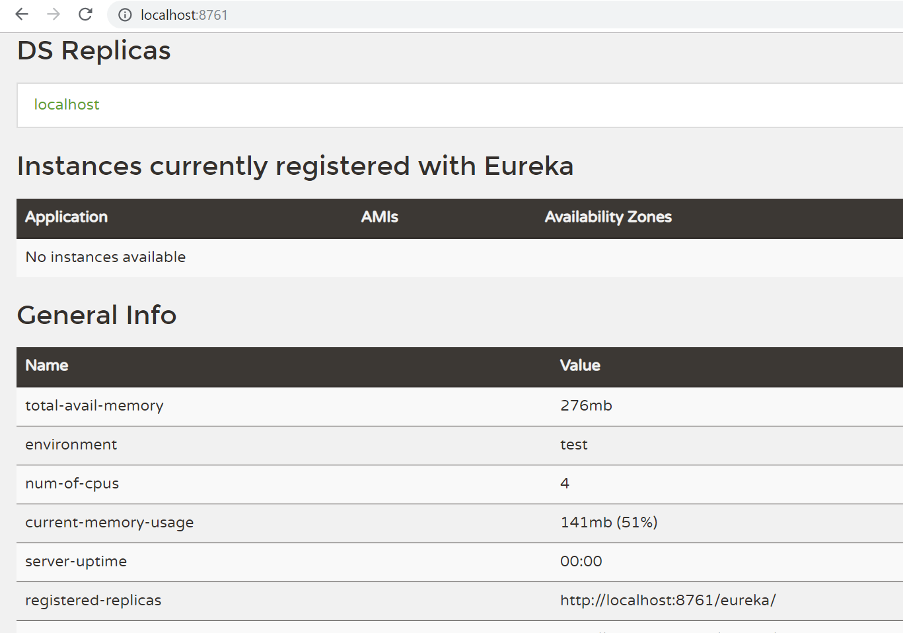

# Communication between microservices

## Introduction

The goal of this session is to have every attendee create a bunch of small services, talking to each other, 
as well as learn the basic patterns about inter-service communication for microservices, 
and getting familiar with supporting technologies.

The overall idea of this architectural style is to implement an application as a system of services.
In an ideal world, applications that require the implementation of several independent tasks which didn't interact with each other, should be the case.
But in my experience, that only rarely happens. There are also tasks that are more complex, and that can't be easily implemented in an independent service which doesn't use any other parts of the system.

In these cases, your microservices need to communicate with each other.

This session will explain the basics concepts and patterns of inter-service communication for microservices using a business case that will be developed during this session.

## Two ways of communication

Microservices are all about separation of concerns and decoupling independent services. But how does communication between those services work?

In a microservices architecture, it is possible to distinguish two ways of communications between the microservices:

- Synchronous: Client sends a request and waits for a response. Client code execution itself may prefer to receive the response via a callback (thread is not blocked) or wait (thread is blocked). Either way, the communication to the external world is synchronous.
- Asynchronous: Client sends a request and doesn't wait for a response.


## Working with synchronous communication: How to Use Netflix's Eureka and Spring Cloud for Service Registry

### Introduction 

*"Eureka is a REST (Representational State Transfer) based service that is primarily used in the AWS cloud for locating services for the purpose of load balancing and failover of middle-tier servers."* - Netflix: Eureka at a Glance, Github

Let's get to setting up this Eureka service registry and a couple of services to see it in practice.

**Service Registration and Discovery with Netflix Eureka**

One of the problems of micro-service architecture is that how to find all other service endpoints.



Netflix Eureka is a lookup server (also called a registry). All micro-services (Eureka clients) in the cluster register themselves to this server.There are other service discovery clients like Consul, Zookeeper etc, but we will be using Eureka in this training course. 

The Client lives within the Service Instance ecosystem. It can be used as embedded with the Service or as a sidecar process. The Client and the Server implement a heartbeat protocol. The Client must send regular heartbeats to the Server. The Server expects these heartbeat messages in order to keep the instance in the registry and to update the instance info, otherwise the instance is removed from the registry. The time frames are configurable.

### Setting Up the Eureka Server

Stand up a Spring-based Eureka Service Registry server is actually, very simple. 

Following these steps can help get you up and running quickly with both a Eureka server and a sample Spring Boot project.

**Create the project**

Create a  new Spring Boot project



and establish the required dependencies. 

```xml
...
	<dependencies>
		<dependency>
			<groupId>org.springframework.boot</groupId>
			<artifactId>spring-boot-starter</artifactId>
		</dependency>

		<dependency>
			<groupId>org.springframework.cloud</groupId>
			<artifactId>spring-cloud-starter-netflix-eureka-server</artifactId>
		</dependency>

		<dependency>
			<groupId>org.springframework.boot</groupId>
			<artifactId>spring-boot-starter-test</artifactId>
			<scope>test</scope>
			<exclusions>
				<exclusion>
					<groupId>org.junit.vintage</groupId>
					<artifactId>junit-vintage-engine</artifactId>
				</exclusion>
			</exclusions>
		</dependency>
	</dependencies>
	
	<dependencyManagement>
		<dependencies>
			<dependency>
				<groupId>org.springframework.cloud</groupId>
				<artifactId>spring-cloud-dependencies</artifactId>
				<version>Finchley.SR2</version>
				<type>pom</type>
				<scope>import</scope>
			</dependency>
		</dependencies>
	</dependencyManagement>	
...
```

**Stand up a Eureka Service Registry**

You can use Spring Cloud's *@EnableEurekaServer* annotation to stand up a registry that other applications can talk to. This is a regular Spring Boot application with one annotation added to enable the service registry.
 
`eureka-service/src/main/java/hello/EurekaServiceApplication.java`
 
```java
@EnableEurekaServer
@SpringBootApplication
public class EurekaServiceApplication {

    public static void main(String[] args) {
        SpringApplication.run(EurekaServiceApplication.class, args);
    }
}

```

By default, the registry will also attempt to register itself, so you'll need to disable that, as well.

It's a good convention to put this registry on a separate port when using it locally. 

Add some properties to your eureka-service/src/main/resources/application.properties to handle all of these requirements.

`eureka-service/src/main/resources/application.properties`
 
```properties
server.port=8761

eureka.client.register-with-eureka=false
eureka.client.fetch-registry=false

logging.level.com.netflix.eureka=OFF
logging.level.com.netflix.discovery=OFF
```

**Start eureka server**

Start the spring boot application. Use the below endpoint to view the eureka server dashboard.


### Case study: bank cards authorization
This case study is the creation of a "complex pipeline" that, using a bunch of microservices, simulates the workflow of bank cards authorization.

Whenever a cardholder uses a credit or debit card in a purchase, the acquiring bank(*) either authorizes or rejects the transaction based on the data from the issuing bank(**) and card network. In short, the acquiring bank receives the payment authorization request from the merchant and then sends it to the issuing bank for approval. If the purchase is approved, the funds are deposited into the merchant's account (usually at regular intervals).

(*) The acquirer, also known as a credit card bank, merchant bank or acquirer, is a bank or financial institution, licensed as a member of a card association (like Visa or MasterCard), that creates and maintains the merchant's bank account. 
(**) The issuing bank, as the term goes, is a bank that issues credit and debit cards to consumers.


**Talking to the registry**

Having spring-cloud-starter-netflix-eureka-client on the classpath makes the app into both a Eureka "instance" (that is, it registers itself) and a "client" (it can query the registry to locate other services).

Following the steps described below can help get you up and running quickly with both a:

  1. **Issuer Authorization service**: which will give some functionality based on CardHolders Accounts. It will be a rest based service and most importantly it will be a Eureka client service, which will talk with eureka service to register itself in the service registry.

  2. **Acquirer Authorization service**: Same type as of Issuer Authorization service. Only added feature is that it will invoke Issuer Authorization service with service look up mechanism. We will not use absolute URL of Issuer Authorization service to interact with that service.


talking to each other.

** Changes in acme-bank project **

* 1. Add *@EnableEurekaClient* annotation on AcmeBankApplication class.
* 2. Add Eureka server configuration elements on application.properties file.

```properties
## Eureka
eureka.client.serviceUrl.defaultZone  = http://localhost:8761/eureka
spring.application.name=acme-bank-services
```

* 3. Code IssuerAuthorizationController

```java
import java.time.LocalDateTime;

import org.springframework.stereotype.Controller;
import org.springframework.web.bind.annotation.RequestBody;
import org.springframework.web.bind.annotation.RequestMapping;
import org.springframework.web.bind.annotation.RequestMethod;
import org.springframework.web.bind.annotation.ResponseBody;

import eu.albertomorales.training.acmebank.dto.IssuerAuthorizationRequest;
import eu.albertomorales.training.acmebank.dto.IssuerAuthorizationResponse;

@Controller
public class IssuerAuthorizationController {

	@RequestMapping(value="/authorization", consumes = "application/json", produces = "application/json", method = RequestMethod.POST)
    @ResponseBody
    public IssuerAuthorizationResponse save(@RequestBody IssuerAuthorizationRequest dto) {
	    LocalDateTime dateTime = LocalDateTime.now();
	    // Everybody is rich :-o
	    String status = "APPROVED"; // or REJECTED
		return new IssuerAuthorizationResponse(dto.getPan(), 
						   					   dto.getAmmount(),
											   dateTime, 
											   status);
    }	
	
}
```

(IssuerAuthorizationRequest and IssuerAuthorizationResponse DTO's needed)

* 4. Add dependencies to spring-cloud on *pom.xml* 

```xml

	<properties>
		...
		<spring-cloud.version>Edgware.SR3</spring-cloud.version>		
	</properties>

	<dependencies>
		...	
		<dependency>
			<groupId>org.springframework.cloud</groupId>
			<artifactId>spring-cloud-starter-netflix-eureka-client</artifactId>
		</dependency>		
		<dependency>
			<groupId>org.springframework.cloud</groupId>
			<artifactId>spring-cloud-starter-netflix-eureka-server</artifactId>
			<scope>test</scope>
		</dependency>	
	</dependencies>		
	
	<dependencyManagement>
		<dependencies>
			<dependency>
				<groupId>org.springframework.cloud</groupId>
				<artifactId>spring-cloud-dependencies</artifactId>
				<version>Greenwich.RELEASE</version>
				<type>pom</type>
				<scope>import</scope>
			</dependency>
		</dependencies>
	</dependencyManagement>
```

** Changes in acme-net project **

* 1. Add *@EnableFeignClients* and *@EnableEurekaClient* on AcmeNetApplication class.
* 2. Add Eureka server configuration elements on application.properties file.

```properties
## Eureka
eureka.client.serviceUrl.defaultZone  = http://localhost:8761/eureka
spring.application.name=acme-net-services
```

* 3. Code IssuerAuthorizationRestClient

```java
import org.springframework.cloud.openfeign.FeignClient;
import org.springframework.web.bind.annotation.RequestBody;
import org.springframework.web.bind.annotation.RequestMapping;
import org.springframework.web.bind.annotation.RequestMethod;
import org.springframework.web.bind.annotation.ResponseBody;

import eu.albertomorales.training.acmenet.dto.IssuerAuthorizationRequest;
import eu.albertomorales.training.acmenet.dto.IssuerAuthorizationResponse;

@FeignClient("acme-bank-services")
public interface IssuerAuthorizationRestClient {

	@RequestMapping(value="/authorization", consumes = "application/json", produces = "application/json", method = RequestMethod.POST)
    @ResponseBody
    public abstract IssuerAuthorizationResponse save(@RequestBody IssuerAuthorizationRequest dto);

}
```

* 4. Code AcquirerAuthorizationController

```java
import java.time.LocalDateTime;

import org.springframework.stereotype.Controller;
import org.springframework.web.bind.annotation.RequestBody;
import org.springframework.web.bind.annotation.RequestMapping;
import org.springframework.web.bind.annotation.RequestMethod;
import org.springframework.web.bind.annotation.ResponseBody;

import eu.albertomorales.training.acmenet.dto.AcquirerAuthorizationRequest;
import eu.albertomorales.training.acmenet.dto.AcquirerAuthorizationResponse;
import eu.albertomorales.training.acmenet.dto.IssuerAuthorizationRequest;
import eu.albertomorales.training.acmenet.dto.IssuerAuthorizationResponse;
import eu.albertomorales.training.acmenet.restclient.IssuerAuthorizationRestClient;

@Controller
public class AcquirerAuthorizationController {

	public AcquirerAuthorizationController(IssuerAuthorizationRestClient issuerAuthorizationRestClient) {
		super();
		this.issuerAuthorizationRestClient = issuerAuthorizationRestClient;
	}

	@RequestMapping(value="/authorization", consumes = "application/json", produces = "application/json", method = RequestMethod.GET)
    @ResponseBody
    public AcquirerAuthorizationResponse save(@RequestBody AcquirerAuthorizationRequest dto) {
		IssuerAuthorizationResponse issuerResponse = 
						issuerAuthorizationRestClient.save(
								new IssuerAuthorizationRequest(
										dto.getPan(), 
										dto.getAmmount()
								)
						);
	    LocalDateTime dateTime = LocalDateTime.now();
	    /*
	    String status = "APPROVED"; // REJECTED
	    */
	    String status = issuerResponse.getStatus();
		return new AcquirerAuthorizationResponse(dto.getPan(), 
												dto.getAmmount(),
												dateTime, 
												status,
												dto.getCountry());
    }	
	
	private IssuerAuthorizationRestClient issuerAuthorizationRestClient;
	
}
```

(AcquirerAuthorizationRequest, AcquirerAuthorizationResponse, IssuerAuthorizationRequest and IssuerAuthorizationResponse DTO's needed)

* 5. Add dependencies to spring-cloud on *pom.xml* 

```xml

	<properties>
		...
		<spring-cloud.version>Edgware.SR3</spring-cloud.version>		
	</properties>

	<dependencies>
		...	
		<dependency>
			<groupId>org.springframework.cloud</groupId>
			<artifactId>spring-cloud-starter-netflix-eureka-client</artifactId>
		</dependency>
		<dependency>
		    <groupId>org.springframework.cloud</groupId>
			<artifactId>spring-cloud-starter-openfeign</artifactId>
		</dependency>				
		<dependency>
			<groupId>org.springframework.cloud</groupId>
			<artifactId>spring-cloud-starter-netflix-eureka-server</artifactId>
			<scope>test</scope>
		</dependency>	
	</dependencies>		
	
	<dependencyManagement>
		<dependencies>
			<dependency>
				<groupId>org.springframework.cloud</groupId>
				<artifactId>spring-cloud-dependencies</artifactId>
				<version>Greenwich.RELEASE</version>
				<type>pom</type>
				<scope>import</scope>
			</dependency>
		</dependencies>
	</dependencyManagement>
```

## Why synchronous communication between microservices would be a bad idea?

 There are certain tradeoffs in synchronous communication between microservices:
 
- It requires a deliberate balancing of the capacity for all the services. 
- It's likely that synchronous communication leaves upstream services susceptible to cascading failure.
- Increased Service Discovery Overhead: each service needs to participate in a central service discovery setup.
- A synchronous system can exhibit much **tighter coupling** over a period of time. Without abstractions in between, services bind directly to the contracts of the other services.

It had been said that synchronous REST can turn microservices back into monoliths.

Sync REST could be ok in external client->microservice communication, internal microservice->microservice communication should rely on asynchronous message-passing.

— Jonas Bonér (@jboner) March 4, 2016

### What does "Async IO" means?

It means that when you communicate over the network (e.g. with another service), your current thread is not blocked until the remote service has responded, but is free to do other things in between.


But this is not the kind of asynchronicity you should be worried about when it comes to communication between your (micro)-services.

### Asynchronous service integration

Pros:

- An asynchronous set-up fares better with temporary bursts of requests.
- Each service connects to a message queue as a consumer or producer. Only the message queue requires service discovery. So the need for a central service discovery solution is less pressing.
- Additionally, since multiple instances of a service are connected to a queue, external load balancing is not required. 


Contras:
- Asynchronous systems tend to be significantly more complex than synchronous ones: Half-a-dozen applications now turn into hundreds of little microservices.
- Reads/Queries require mediation.
- Message buses are a SPOC. This is not a trade-off, but a precaution. 
- Eventual Consistency: An asynchronous system can be eventually consistent. It means that results in queries may not be latest, even though the system has issued the writes. While this trade-off allows the system to scale better, it is something to factor-in into system’s design and user experience both.


You can read more about "factors of distributed software" in great depth [here](https://martinfowler.com/articles/microservice-trade-offs.html#distribution) from the master Fowler.

### Orchestation v.s. Choreography

How to stitch microservice modules working together?

- When a service oriented architecture uses an **orchestration** pattern for communication, there are point-to-point connection between the services. 
- Applying a **choreography** pattern means that one service doesn’t talk to another service in order to instruct an action (several patterns: Event Sourcing, CQRS...)


<div align="center" size="100%"><h6><sub>Orchestration vs. Choreography, Source: <i>www.thoughtworks.com</i></sub></h6></div>

## Bibliography


Building microservices is a 2015 book by Sam Newman. It's a practical book that covers the topics that system architects and administrators must consider when building, managing, and evolving microservice architectures.