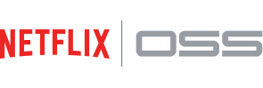
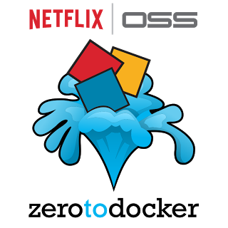

## Netflix OSS

What does (Netflix) OSS stands for? [Netflix OSS](https://netflix.github.io/) is nothing but Open Source Software contributed by Netflix Team, to the Open Source Community.

The code helps developers handle several aspects of cloud platform development, such as big data analytics, storing and serving data in the cloud, improving
performance, and ensuring security at scale.

Here we focus on some of the most popular Netflix OSS projects for building microservices architectures:

* [Archaius](https://github.com/Netflix/archaius) is a Java library for distributed configuration.
* [Eureka](https://github.com/Netflix/eureka) is a REST-based registry service that features the Eureka Client, a Java-based client component that improves interactions with the service.
* [Hystrix](https://github.com/Netflix/hystrix) is a latency and fault tolerance library, as a means to control the interactions between microservices.
* [Ribbon](https://github.com/Netflix/ribbon) is a client-side inter-process communication (IPC) library which
* [Zuul](https://github.com/Netflix/zuul) is the glue holding together the Netflix microservices architecture. Netflix uses Zuul as a gateway service for its streaming application and the Netflix API. Among its functions are dynamic routing, canary and stress testing, load shedding, static response handling, authentication and security, and insights and monitoring.

Do you dare to download and dive into [ZeroToDocker](https://github.com/Netflix-Skunkworks/zerotodocker) ?

