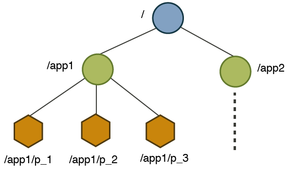
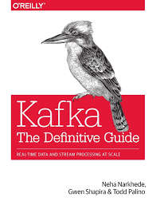

#Getting started with Apache Kafka

## How to install Apache Kafka on Ubuntu

Prerequisites:
 
- (obvious) O.S. up & running
- At least 4Gb RAM. 
- Java JVM installed.

### Steps

* Creating a user for kafka, with sudo capabilities:

```shell
sudo useradd kafka -m
sudo passwd kafka
sudo adduser kafka sudo
```

* Downloading and extractiong latest stable Kafka binaries

```shell
su -l kafka
mkdir ~/Downloads
curl "https://www.apache.org/dist/kafka/2.3.1/kafka_2.11-2.3.1.tgz" -o ~/Downloads/kafka.tgz
mkdir ~/kafka && cd ~/kafka
tar -xvzf ~/Downloads/kafka.tgz --strip 1
```

* Configuring the Kafka server

Edit KAFKA_HOME/config/server.properties and add this line to the bottom of the file, to allow us to delete Kafka topics:

```file
delete.topic.enable = true
```

* Creating Systemd Unit Files and Starting the Kafka Server

Service file for Zookeeper (`/etc/systemd/system/zookeeper.service`):

```file
[Unit]
Requires=network.target remote-fs.target
After=network.target remote-fs.target

[Service]
Type=simple
User=kafka
ExecStart=/home/kafka/kafka/bin/zookeeper-server-start.sh /home/kafka/kafka/config/zookeeper.properties
ExecStop=/home/kafka/kafka/bin/zookeeper-server-stop.sh
Restart=on-abnormal

[Install]
WantedBy=multi-user.target
```

Service file for Kafka (`/etc/systemd/system/kafka.service`):

```file
[Unit]
Requires=zookeeper.service
After=zookeeper.service

[Service]
Type=simple
User=kafka
ExecStart=/bin/sh -c '/home/kafka/kafka/bin/kafka-server-start.sh /home/kafka/kafka/config/server.properties > /home/kafka/kafka/kafka.log 2>&1'
ExecStop=/home/kafka/kafka/bin/kafka-server-stop.sh
Restart=on-abnormal

[Install]
WantedBy=multi-user.target
```

And finally start the service:

```shell
sudo systemctl start kafka
```

If you want Kafka to be started automatically when system reboots, run:

```shell
sudo systemctl enable kafka
```

To check Kafka state out:

```shell
sudo journalctl -u kafka
```

## A brief contact with Apache Zookeeper

Model:

Similar to a filesystem, you can create nodes in a heirachical way. Each Znode maintains statistical data like version number, ACL's and timestamps.



API:
- create data path
- delete path
- exists path
- get path [watch]
- set path data [version]
- sync path

Zookeeper shell:

```shell
sudo su -l kafka
cd kafka
./bin/zookeeper-shell.sh lab
...
./bin/zookeeper-shell.sh lab ls /
...
./bin/zookeeper-shell.sh lab ls /brokers/ids
...
```

## CLI command and options related to Kafka topics

Below are some basic examples of how *kafka-topics.sh* shell can be used to manage Kafka topics.

### Create a Kafka topic

Creating "curso" topic with 1 partition, replication factor 1:

```shell
./bin/kafka-topics.sh --zookeeper lab --create --topic curso --partitions 1 --replication-factor 1
```

*Created topic curso.*

### List Kafka topics

```shell
./bin/kafka-topics.sh --list --zookeeper lab
```

Can you find why this command doesn't work?

```shell
./bin/kafka-topics.sh --zookeeper lab --create --topic imposible --partitions 1 --replication-factor 3
```

### Topic-level configuration

```shell
./bin/kafka-topics.sh --describe --zookeeper lab --topic curso
```

Output:

```console
Topic:curso     PartitionCount:1        ReplicationFactor:1     Configs:
        Topic: curso    Partition: 0    Leader: 0       Replicas: 0     Isr: 0
```

The first line gives a summary of all the partitions, each additional line gives information about one partition. Since we have only one partition for this topic there is only one line.

* "Leader" is the node responsible for all reads and writes for the given partition. Each node will be the leader for a randomly selected portion of the partitions.
* "Replicas" is the list of nodes that replicate the log for this partition regardless of whether they are the leader or even if they are currently alive.
* "Isr" is the set of "in-sync" replicas. This is the subset of the replicas list that is currently alive and caught-up to the leader.

### Delete kafka topic

```shell
./bin/kafka-topics.sh --zookeeper lab --delete --topic imposible 
```

## Console producer & consumer

### Console producer:

```shell
./bin/kafka-console-producer.sh --broker-list lab:9092 --topic curso
```

### Console consumer:

```shell
./bin/kafka-console-consumer.sh --bootstrap-server lab:9092 --topic curso --from-beginning
```

## Java producer & consumer

### First Java producer:

```java
	Properties prop = new Properties();
	prop.setProperty(ProducerConfig.BOOTSTRAP_SERVERS_CONFIG, BOOTSTRAP_SERVERS);
	prop.setProperty(ProducerConfig.CLIENT_ID_CONFIG, "CLI1");
	prop.put(ProducerConfig.KEY_SERIALIZER_CLASS_CONFIG,"org.apache.kafka.common.serialization.StringSerializer");
	prop.put(ProducerConfig.VALUE_SERIALIZER_CLASS_CONFIG,"org.apache.kafka.common.serialization.StringSerializer");		
	Producer<String, String> producer = new KafkaProducer<String, String>(prop);
	String value = "Evento "+ new Date();
	ProducerRecord<String, String> event = new ProducerRecord<String, String> (TOPIC_NAME, value);
	producer.send(event);
	System.out.printf("Producer Record:(%d, %s, %d)\n",
   						 event.key(), event.value(),
        				 event.partition());		
	producer.close();
```

The necessary properties for the producer must be included using a Java properties. First of all, we instantiate a Kafka producer that uses the properties object.

When producing events, topic and value are required. Partition and key are optional elements. The class used for producing events is ProducerRecord. 

Finally, the event is sent using the *send(...)* method.

### First Java consumer:

```java
	
private final String BOOTSTRAP_SERVERS = "192.168.1.80:9092";
private final String TOPIC_NAME = "curso";
private final String GROUP_ID = "KAfkaExampleConsumer";
	
private Consumer<Long, String> createConsumer() {
	final Properties props = new Properties();
	props.put(ConsumerConfig.BOOTSTRAP_SERVERS_CONFIG,
	                            BOOTSTRAP_SERVERS);
	props.put(ConsumerConfig.GROUP_ID_CONFIG,
	                            GROUP_ID);
	props.put(ConsumerConfig.KEY_DESERIALIZER_CLASS_CONFIG,
	        StringDeserializer.class.getName());
	props.put(ConsumerConfig.VALUE_DESERIALIZER_CLASS_CONFIG,
	        StringDeserializer.class.getName());
		
	props.put(ConsumerConfig.ENABLE_AUTO_COMMIT_CONFIG, Boolean.FALSE);
		
	// Create the consumer using props.
	final Consumer<Long, String> consumer =
	                            new KafkaConsumer<>(props);
		
	// Subscribe to the topic.
	consumer.subscribe(Collections.singletonList(TOPIC_NAME));
	return consumer;
}

private void doIt() {
    Consumer<Long, String> consumer = createConsumer();
    final int giveUp = 100;   
    int noRecordsCount = 0;

    while (true) {
		final ConsumerRecords<Long, String> consumerRecords =
			consumer.poll(1000);

		if (consumerRecords.count()==0) {
			noRecordsCount++;
			if (noRecordsCount > giveUp) break;
			else continue;
		}

		consumerRecords.forEach(record -> {
			System.out.printf("Consumer Record:(%d, %s, %d, %d)\n",
				record.key(), record.value(),
				record.partition(), record.offset());
			});

		consumer.commitAsync();
	}
	consumer.close();
	System.out.println("DONE");
}
```

The necessary properties for the consumer must be included using a Java properties. First of all, we instantiate a Kafka consumer that uses the properties object.

Then we must subscribe the consumer to the desired topics (several topics allowed).

Finally, through an active wait we consume the events that occur through the *poll(...)* method.

### Playing with partitions and consumer groups

** SecondProducer **

Main diferences with FirstProducer are:

- Events with Integer keys
- Events are produced in loop, with a Thread.sleep in between

** SecondConsumer **

Main diferences with FirstProducer are:

- Events with Integer keys
- We can specify consumer group when consumer stars

** Atention **

Let's answer the following questions:

- If you start two consumers (with the same consumer group), why only one appears to work?
- Ok, we have two consumers working, but... Why does it finish without proccessing all events?  


## Bibliography



"Kafka: The definitive guide" is a 2017 book by Neha Narkhede. Engineers from Confluent and LinkedIn who are responsible for developing Kafka explain how to deploy production Kafka clusters, write reliable **event-driven microservices**, and build scalable stream-processing applications with this platform. Through detailed examples, you’ll learn Kafka’s design principles, reliability guarantees, key APIs, and architecture details, including the replication protocol, the controller, and the storage layer.
