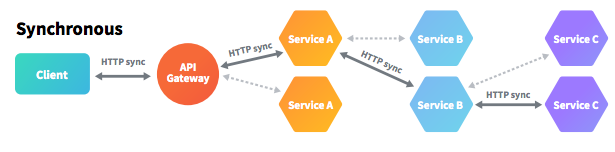
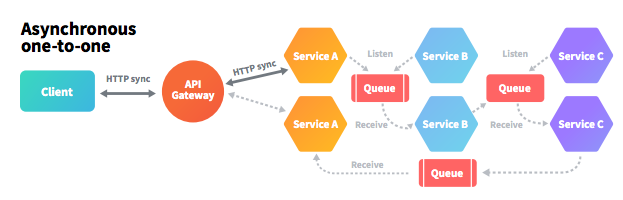
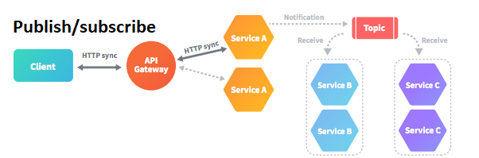
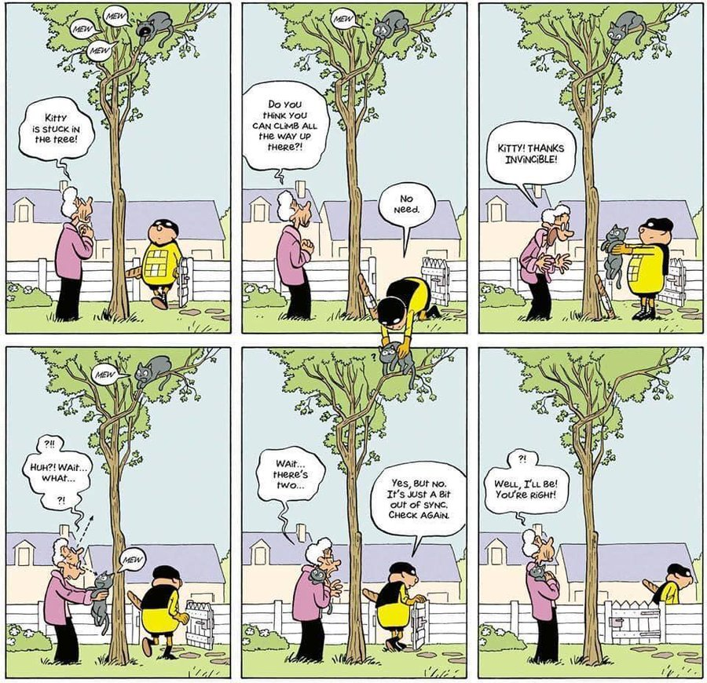
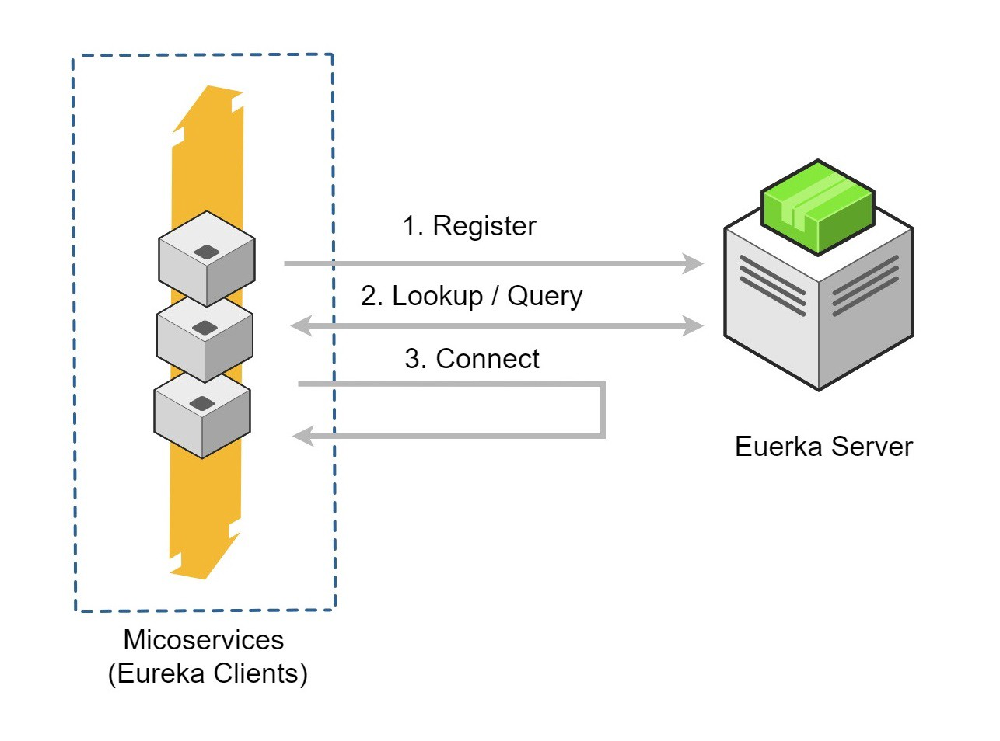
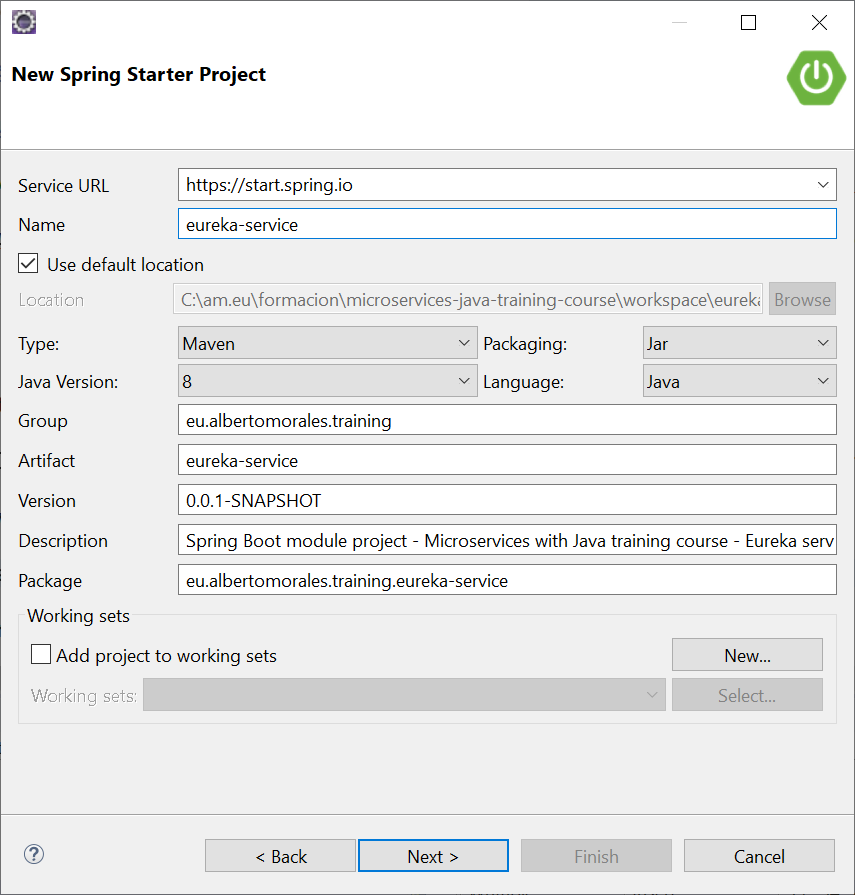
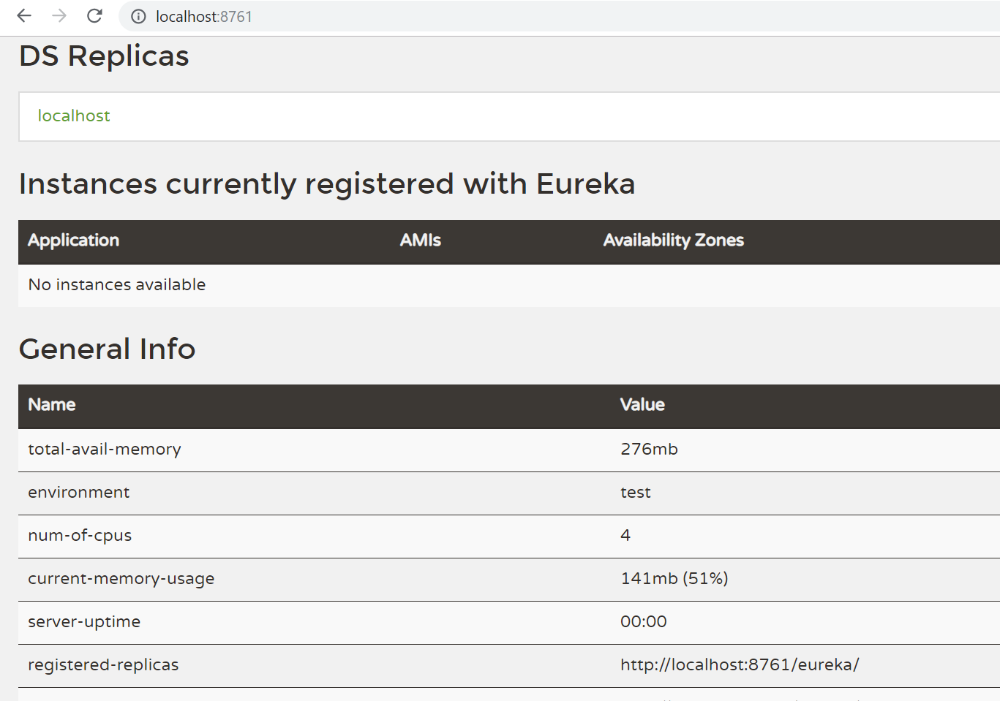
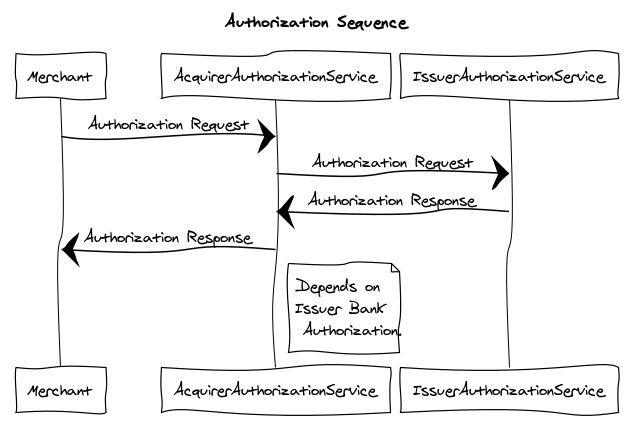

# Communication between microservices

## Introduction

The goal of this session is to have every attendee create a bunch of small services, talking to each other, 
as well as learn the basic patterns about inter-service communication for microservices, 
and getting familiar with supporting technologies.

The overall idea of this architectural style is to implement an application as a system of services.
In an ideal world, applications that require the implementation of several independent tasks which didn't interact with each other, should be the case.
But in my experience, that only rarely happens. There are also tasks that are more complex, and that can't be easily implemented in an independent service which doesn't use any other parts of the system.

In these cases, your microservices need to communicate with each other.

This session will explain the basics concepts and patterns of inter-service communication for microservices using a business case that will be developed during this session.

### Case study: bank cards authorization
This case study is the creation of a "complex pipeline" that, using a bunch of microservices, simulates the workflow of bank cards authorization.

Whenever a cardholder uses a credit or debit card in a purchase, the acquiring bank(*) either authorizes or rejects the transaction based on the data from the issuing bank(**) and card network. In short, the acquiring bank receives the payment authorization request from the merchant and then sends it to the issuing bank for approval. If the purchase is approved, the funds are deposited into the merchant's account (usually at regular intervals).

(*) The acquirer, also known as a credit card bank, merchant bank or acquirer, is a bank or financial institution, licensed as a member of a card association (like Visa or MasterCard), that creates and maintains the merchant's bank account. 
(**) The issuing bank, as the term goes, is a bank that issues credit and debit cards to consumers.

## Two ways of communication

Microservices are all about separation of concerns and decoupling independent services. But how does communication between those services work?

In a microservices architecture, it is possible to distinguish two ways of communications between the microservices:

* Synchronous: a microservice directly calls the other microservice and requires an immediate response, which results in dependency between the services.
On web application communication, the HTTP protocol has been the standard for many years, and that is no different for microservices. It is a synchronous, stateless protocol.
In synchronous communication, the client sends a request and waits for a response from the service. However, using that protocol, the client can communicate asynchronously with a server, which means that a thread is not blocked, and the response will reach a callback eventually. An example of such a library, which provides the most common pattern for synchronous REST communication,is Spring Cloud Netflix.



* Asynchronous: a microservice directly/indirectly calls the other microservice and receive a non-immediate response in a new transaction. 
 In most cases, such communication is realized with messaging brokers. The message producer usually does not wait for a response. It just waits for acknowledgment that the message has been received by the broker. 
The responsible microservice takes all requests, processes it and returns the result to the caller in an asynchronous way. Local message queues can be used for this purpose, but often messaging frameworks like Apache Kafka, Apache ActiveMQ, RabbitMQ or any other scalable messaging solution provide the best capabilities to achieve guaranteed delivery.





## Working with synchronous communication: How to Use Netflix's Eureka and Spring Cloud for Service Registry

### Introduction 

For today, your microservices need to communicate with each other. But that sounds a lot easier than it seems. As soon as your services need to interact with each other, you can't any longer ignore that you're building a distributed system.

** Problems of distributed systems **

Some of them:

* Eventual Consistency: Microservices introduce eventual consistency issues because of their insistence on decentralized data management.



* Independent Deployment: A key principle of microservices is that services are components and thus are independently deployable.

* Operational Complexity: Half-a-dozen applications now turn into hundreds of little microservices

* Technology Diversity: Since each microservice is an independently deployable unit, you have considerable freedom in your technology choices within it.

* Performance... Fault Tolerance ... Logging and Monitoring... 

You can read these matters in great depth [here](https://martinfowler.com/articles/microservice-trade-offs.html#distribution) from the master Fowler.

*"Eureka is a REST (Representational State Transfer) based service that is primarily used in the AWS cloud for locating services for the purpose of load balancing and failover of middle-tier servers."* - Netflix: Eureka at a Glance, Github

Let's get to setting up this Eureka service registry and a couple of services to see it in practice.

**Service Registration and Discovery with Netflix Eureka**

One of the problems of micro-service architecture is that how to find all other service endpoints.



Netflix Eureka is a lookup server (also called a registry). All micro-services (Eureka clients) in the cluster register themselves to this server.There are other service discovery clients like Consul, Zookeeper etc, but we will be using Eureka in this training course. 

The Client lives within the Service Instance ecosystem. It can be used as embedded with the Service or as a sidecar process. The Client and the Server implement a heartbeat protocol. The Client must send regular heartbeats to the Server. The Server expects these heartbeat messages in order to keep the instance in the registry and to update the instance info, otherwise the instance is removed from the registry. The time frames are configurable.

### Setting Up the Eureka Server

Stand up a Spring-based Eureka Service Registry server is actually, very simple. 

Following these steps can help get you up and running quickly with both a Eureka server and a sample Spring Boot project.

**Create the project**

Create a  new Spring Boot project



and establish the required dependencies. 

```xml
...
	<dependencies>
		<dependency>
			<groupId>org.springframework.boot</groupId>
			<artifactId>spring-boot-starter</artifactId>
		</dependency>

		<dependency>
			<groupId>org.springframework.cloud</groupId>
			<artifactId>spring-cloud-starter-netflix-eureka-server</artifactId>
		</dependency>

		<dependency>
			<groupId>org.springframework.boot</groupId>
			<artifactId>spring-boot-starter-test</artifactId>
			<scope>test</scope>
			<exclusions>
				<exclusion>
					<groupId>org.junit.vintage</groupId>
					<artifactId>junit-vintage-engine</artifactId>
				</exclusion>
			</exclusions>
		</dependency>
	</dependencies>
	
	<dependencyManagement>
		<dependencies>
			<dependency>
				<groupId>org.springframework.cloud</groupId>
				<artifactId>spring-cloud-dependencies</artifactId>
				<version>Finchley.SR2</version>
				<type>pom</type>
				<scope>import</scope>
			</dependency>
		</dependencies>
	</dependencyManagement>	
...
```

**Stand up a Eureka Service Registry**

You can use Spring Cloud's *@EnableEurekaServer* annotation to stand up a registry that other applications can talk to. This is a regular Spring Boot application with one annotation added to enable the service registry.
 
`eureka-service/src/main/java/hello/EurekaServiceApplication.java`
 
```java
@EnableEurekaServer
@SpringBootApplication
public class EurekaServiceApplication {

    public static void main(String[] args) {
        SpringApplication.run(EurekaServiceApplication.class, args);
    }
}

```

By default, the registry will also attempt to register itself, so you'll need to disable that, as well.

It's a good convention to put this registry on a separate port when using it locally. 

Add some properties to your eureka-service/src/main/resources/application.properties to handle all of these requirements.

`eureka-service/src/main/resources/application.properties`
 
```properties
server.port=8761

eureka.client.register-with-eureka=false
eureka.client.fetch-registry=false

logging.level.com.netflix.eureka=OFF
logging.level.com.netflix.discovery=OFF
```

**Start eureka server**

Start the spring boot application. Use the below endpoint to view the eureka server dashboard.


### Talking to the registry

Having spring-cloud-starter-netflix-eureka-client on the classpath makes the app into both a Eureka "instance" (that is, it registers itself) and a "client" (it can query the registry to locate other services).

Don't forget the case study: 



Following the steps described below can help get you up and running quickly with both a:

  1. **Issuer Authorization service**: which will give some functionality based on CardHolders Accounts. It will be a rest based service and most importantly it will be a Eureka client service, which will talk with eureka service to register itself in the service registry.

  2. **Acquirer Authorization service**: Same type as of Issuer Authorization service. Only added feature is that it will invoke Issuer Authorization service with service look up mechanism. We will not use absolute URL of Issuer Authorization service to interact with that service.


talking to each other.

** Changes in acme-bank project **

1. Add *@EnableEurekaClient* annotation on AcmeBankApplication class.
2. Add Eureka server configuration elements on application.properties file.

```properties
## Eureka
eureka.client.serviceUrl.defaultZone  = http://localhost:8761/eureka
spring.application.name=acme-bank-services
```

3. Code IssuerAuthorizationController

```java
import java.time.LocalDateTime;

import org.springframework.stereotype.Controller;
import org.springframework.web.bind.annotation.RequestBody;
import org.springframework.web.bind.annotation.RequestMapping;
import org.springframework.web.bind.annotation.RequestMethod;
import org.springframework.web.bind.annotation.ResponseBody;

import eu.albertomorales.training.acmebank.dto.IssuerAuthorizationRequest;
import eu.albertomorales.training.acmebank.dto.IssuerAuthorizationResponse;

@Controller
public class IssuerAuthorizationController {

	@RequestMapping(value="/authorization", consumes = "application/json", produces = "application/json", method = RequestMethod.POST)
    @ResponseBody
    public IssuerAuthorizationResponse save(@RequestBody IssuerAuthorizationRequest dto) {
	    LocalDateTime dateTime = LocalDateTime.now();
	    // Everybody is rich :-o
	    String status = "APPROVED"; // or REJECTED
		return new IssuerAuthorizationResponse(dto.getPan(), 
						   					   dto.getAmmount(),
											   dateTime, 
											   status);
    }	
	
}
```

(IssuerAuthorizationRequest and IssuerAuthorizationResponse DTO's needed)

4. Add dependencies to spring-cloud on *pom.xml* 

```xml

	<properties>
		...
		<spring-cloud.version>Edgware.SR3</spring-cloud.version>		
	</properties>

	<dependencies>
		...	
		<dependency>
			<groupId>org.springframework.cloud</groupId>
			<artifactId>spring-cloud-starter-netflix-eureka-client</artifactId>
		</dependency>		
		<dependency>
			<groupId>org.springframework.cloud</groupId>
			<artifactId>spring-cloud-starter-netflix-eureka-server</artifactId>
			<scope>test</scope>
		</dependency>	
	</dependencies>		
	
	<dependencyManagement>
		<dependencies>
			<dependency>
				<groupId>org.springframework.cloud</groupId>
				<artifactId>spring-cloud-dependencies</artifactId>
				<version>Greenwich.RELEASE</version>
				<type>pom</type>
				<scope>import</scope>
			</dependency>
		</dependencies>
	</dependencyManagement>
```

** Changes in acme-net project **

1. Add *@EnableFeignClients* and *@EnableEurekaClient* on AcmeNetApplication class.
2. Add Eureka server configuration elements on application.properties file.

```properties
## Eureka
eureka.client.serviceUrl.defaultZone  = http://localhost:8761/eureka
spring.application.name=acme-net-services
```

3. Code IssuerAuthorizationRestClient

```java
import org.springframework.cloud.openfeign.FeignClient;
import org.springframework.web.bind.annotation.RequestBody;
import org.springframework.web.bind.annotation.RequestMapping;
import org.springframework.web.bind.annotation.RequestMethod;
import org.springframework.web.bind.annotation.ResponseBody;

import eu.albertomorales.training.acmenet.dto.IssuerAuthorizationRequest;
import eu.albertomorales.training.acmenet.dto.IssuerAuthorizationResponse;

@FeignClient("acme-bank-services")
public interface IssuerAuthorizationRestClient {

	@RequestMapping(value="/authorization", consumes = "application/json", produces = "application/json", method = RequestMethod.POST)
    @ResponseBody
    public abstract IssuerAuthorizationResponse save(@RequestBody IssuerAuthorizationRequest dto);

}
```

4. Code AcquirerAuthorizationController

```java
import java.time.LocalDateTime;

import org.springframework.stereotype.Controller;
import org.springframework.web.bind.annotation.RequestBody;
import org.springframework.web.bind.annotation.RequestMapping;
import org.springframework.web.bind.annotation.RequestMethod;
import org.springframework.web.bind.annotation.ResponseBody;

import eu.albertomorales.training.acmenet.dto.AcquirerAuthorizationRequest;
import eu.albertomorales.training.acmenet.dto.AcquirerAuthorizationResponse;
import eu.albertomorales.training.acmenet.dto.IssuerAuthorizationRequest;
import eu.albertomorales.training.acmenet.dto.IssuerAuthorizationResponse;
import eu.albertomorales.training.acmenet.restclient.IssuerAuthorizationRestClient;

@Controller
public class AcquirerAuthorizationController {

	public AcquirerAuthorizationController(IssuerAuthorizationRestClient issuerAuthorizationRestClient) {
		super();
		this.issuerAuthorizationRestClient = issuerAuthorizationRestClient;
	}

	@RequestMapping(value="/authorization", consumes = "application/json", produces = "application/json", method = RequestMethod.GET)
    @ResponseBody
    public AcquirerAuthorizationResponse save(@RequestBody AcquirerAuthorizationRequest dto) {
		IssuerAuthorizationResponse issuerResponse = 
						issuerAuthorizationRestClient.save(
								new IssuerAuthorizationRequest(
										dto.getPan(), 
										dto.getAmmount()
								)
						);
	    LocalDateTime dateTime = LocalDateTime.now();
	    /*
	    String status = "APPROVED"; // REJECTED
	    */
	    String status = issuerResponse.getStatus();
		return new AcquirerAuthorizationResponse(dto.getPan(), 
												dto.getAmmount(),
												dateTime, 
												status,
												dto.getCountry());
    }	
	
	private IssuerAuthorizationRestClient issuerAuthorizationRestClient;
	
}
```

(AcquirerAuthorizationRequest, AcquirerAuthorizationResponse, IssuerAuthorizationRequest and IssuerAuthorizationResponse DTO's needed)

5. Add dependencies to spring-cloud on *pom.xml* 

```xml

	<properties>
		...
		<spring-cloud.version>Edgware.SR3</spring-cloud.version>		
	</properties>

	<dependencies>
		...	
		<dependency>
			<groupId>org.springframework.cloud</groupId>
			<artifactId>spring-cloud-starter-netflix-eureka-client</artifactId>
		</dependency>
		<dependency>
		    <groupId>org.springframework.cloud</groupId>
			<artifactId>spring-cloud-starter-openfeign</artifactId>
		</dependency>				
		<dependency>
			<groupId>org.springframework.cloud</groupId>
			<artifactId>spring-cloud-starter-netflix-eureka-server</artifactId>
			<scope>test</scope>
		</dependency>	
	</dependencies>		
	
	<dependencyManagement>
		<dependencies>
			<dependency>
				<groupId>org.springframework.cloud</groupId>
				<artifactId>spring-cloud-dependencies</artifactId>
				<version>Greenwich.RELEASE</version>
				<type>pom</type>
				<scope>import</scope>
			</dependency>
		</dependencies>
	</dependencyManagement>
```
