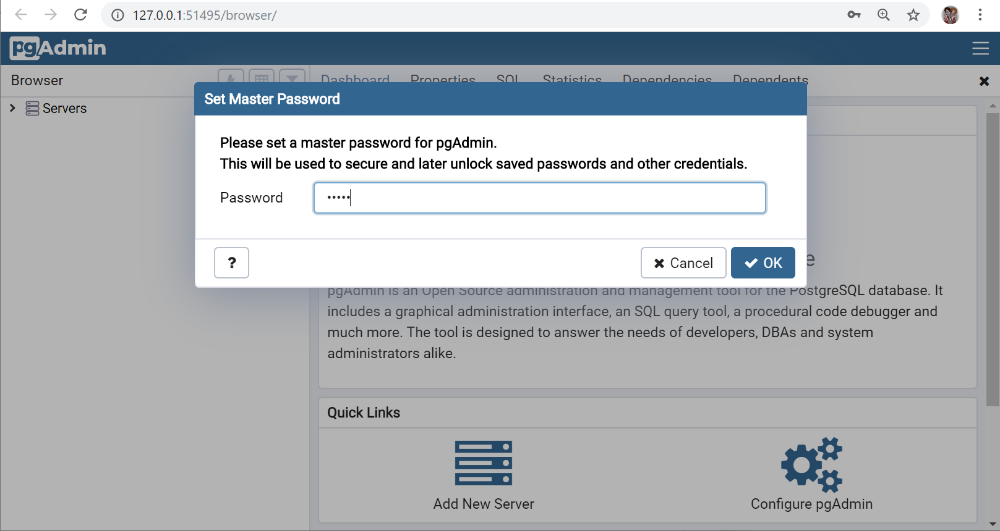

# RESTful  Web Services, persistence and entity classes

## Introduction

The goal of this session is to provide you full autonomy exposing RESTful services with Spring Boot, Spring data and JPA access data stored in a relational database.
 
The goal of this session is to have every attendee create a small project, to build with and understand the technology and how 
developers can take advantage of it in their daily workflow.

The goal of the session was to take a WebClient and update it to work asynchronously with live code.

https://www.digitalocean.com/community/tutorials/como-instalar-y-usar-docker-en-ubuntu-16-04-es

The goal of this session is to achieve full autonomy by installing and configuring Airflow with a standard and easy configuration 
(but effective for most projects), as well as learn the basic functionalities about workflows creation and getting familiar with 
Airflow web interface.

This introduction will explain the basics concepts of Airflow using a business case that will be developed during this session.

This case study is the creation of a pipeline that, using this dataset about High Speed train tickets, try to predict its price
and cluster the ticket belong (two models, one supervised and other unsupervised have been training before, and are available through
different endpoints).

1. Mocks user alarms for Renfe tickets. Those alarms are just a ticket scrapped in a very particular point of time we want to track.
2. Predicts future (next week price), and compare to original price.
3. Perform a clustering of ticket (just for learning purposes).

## Spring Boot: motivation, advantages and disadvantages

### Current situation and motivation for Spring Boot existance

Currently the management and orchestration of processes has been carried out using various tools and methodologies, for example:

* Shell scripts.
* Python scripts.
* R scripts.
* Jupyter Notebooks.
* Cron
* Oozie

At the same time, the Data practice has evolved due to:

* More data accumulated by companies. They want to use that data.
* Companies whose activity was not oriented to the storage and exploitation of the data from the beginning, but that 
    want to invest and transform into data-oriented organizations.
* Data accumulated in very heterogeneous sources (relational databases, Big Data infrastructure, cloud infrastructure).

All this causes an increasing complexity when working with data and designing processes for its exploitation:

* It is more complicated and critical to monitor (executions, failures).
* It is more complicated to find bugs and fix them (search the logs, etc.).
* It is more complicated to maintain the processes and introduce changes without affecting critical parts.

Apache Airflow has gained great popularity in the coming years, especially due to the rise of Data projects using Machine 
Learning libraries written in Python or whose main API is in Python, which is becoming the 
[reference language] (https://stackoverflow.blog/2017/09/06/incredible-growth-python/) in the field of data analysis 
and artificial intelligence (sorry R).

If programming languages were divided in terms of their efficiency and
[speed] (http://www.bioinformatics.org/benchmark/results.html) in execution, 
there would be 3 distinct groups:

1. Fast languages: C, C ++, Fortran.
2. Languages with intermediate speed: Java, Scala.
3. Slow languages: Python, Ruby, Perl.

Most of the code written in Python for scientific computing and data analysis, uses under the hood extensions 
in C or C ++ (as in the case of NumPy or Tensorflow). Python does a good job as a wrapper and nexus of
code written in other (faster) languages. At the same time, its learning curve is reduced compared to
other languages, so it attracts users with little experience in programming and software development, but with
solid knowledge about data analytics. Growth in recent years has been exponential.


## Spring Boot Introduction

### Spring Boot features

Python properties as a 'glue' language fit perfectly with the concept proposed by Apache Airflow, that is why its 
use has increased since its [release](https://airbnb.io/projects/airflow/) by the AirBnB engineering team.

Apache Airflow is defined as:

> A platform to programmatically author, schedule and monitor workflows.

The main features of Apache Airflow are the following:

* Usability
     * Web interface.
     * Creation and use of connections with diverse infrastructure.
     * Review of logs of each task independently.
     * Visualization of the executed code in each task.
* Robustness:
     * Task retry management.
     * Dependency between tasks.
* Elegant:
     * Definition of execution graphs (DAGs) as .py files
     * Minimum knowledge about scripting required.
     
### Spring Boot operating scheme
     
Airflow consists of 4 main components.

* Webserver:
     * Process monitoring and visualization.
     * Query execution logs.
     * Definition of 'connections'.
* Scheduler:
     * Launching tasks and processes at the right time and order.
* Metadata database:
     * Storage of the status of tasks and processes: queued, running, retrying, finished, failed.
     * Storage of connections, users, passwords, etc.
* Worker (optional):
     * This component is responsible for executing the tasks offering additional functionalities to the execution by 
     default. These additional functionalities usually have to do with the distribution of the execution.
        
### Main components of Spring Boot

The main components of Spring Boot are the following:

* DAG: Acronym for Directed Acyclic Graph: it is a set of tasks arranged according to a certain 
dependence between them and that are executed with a certain periodicity.
* Tasks: execution units.
* Operators: define the type of task. They are subdivided into three types:
    * Operators: execute some arbitrary action.
    * Transfers: move information between different locations.
    * Sensors: wait for changes in the system to start the execution.
 * Hooks: communication interfaces with the infrastructure.
 * Plugins: extensions of all the previous elements.
 
### Ways to create a Spring Boot project.

There is a big difference in the way processes are executed in Apache Airflow. The element that performs the execution 
of the end of tasks in Airflow is called executor. There are several types of executors, each with their strengths
and drawbacks:

* Sequential executor: is the default executor of Apache Airflow. It is characterized by executing tasks sequentially 
(without any parallelization). It is good for prototyping processes and developing.
* Local executor: uses Python built-in multiprocessing library. Its great advantage is that it does not require any 
external elements to work and supports parallelization of tasks in a local machine. It is a good option when airflow 
tasks needs some processing power and scheduler is on a single computer.
* [Celery](http://www.celeryproject.org/) executor: Celery is by definition a distributed task queue. Its
main feature is that it allows to distribute the tasks by several machines that are coordinated with the help of a 
broker like Redis or RabbitMQ.
* [Dask](https://dask.org/) executor: Dask has been one of the great revelations in the analytical community that allow 
to distribute Python natively. Its main feature is that beyond distributing tasks by certain components of a cluster, 
Dask distributes the tasks themselves, using distributed arrays of pandas and numpy. Please note the difference between
distributing tasks and distributed tasks.

## Spring Boot + Spring data JPA + PostgreSQL project 

### Pre-requisites: 

- RESTful  Web Services with Spring Boot [session](./../RESTFul-Web-Service-Spring-Boot.md) finished.

- SGBD (PostgreSQL	) installed.
We recommend to follow this [guide](http://www.postgresqltutorial.com/install-postgresql/) that illustrates the PostgreSQL installation proccess (at the current time we use PostgreSQL 12)

### Step 1: PostgreSQL admin tool installation

As with every SBBD, we need a GUI tool for manipulating, visualizing and sharing the data living in Postgres server.

For this training course we are using pgAdmin, which  is the most popular Open Source administration and development platform for PostgreSQL.



This is how the main pgAdmin UI looks like:


It allows you run queries as well as explore and examine your server and databases. The URL to access pgAdmin is

`http://127.0.0.1:51495/browser/`

### Step 2. ACME Bank database setup

Once the setup of all requirements has been satisfied, a database that supports features for the ACME Bank application must be setup.

Let's start. First of all, create a new database.

 In the Object Tree, right click and select create a database.


 In the pop-up, enter database name and encoding (optional). Finally Click Save.


DB is created and shown in the Object tree. In the Object tree, right click and select Query Tool to open a new query tool panel conected to de recently created database.


Open the file schema.sql located in `workspace\acme-bank\src\site\docs` folder, and "run" its content inside the new query tool panel.


Database ERD shown below:


### Step 3. Dependencies

Before adding some persistence code to the project, first you have to add the required dependencies to `pom.xml`. Adding spring-boot-starter-data-jpa dependency to `pom.xml` is needed, and provides transitively Spring data, Hibernate, HikariCP and related dependencies.

```xml
		<dependency>
			<groupId>org.springframework.boot</groupId>
			<artifactId>spring-boot-starter-data-jpa</artifactId>
		</dependency>
```

We must add PostgreSQL database dependency too.

```xml
	<dependency>
		<groupId>org.postgresql</groupId>
		<artifactId>postgresql</artifactId>
	</dependency>
```

### Step 4. Persistent Entity
Using JPA, you can designate any POJO class as a JPA entity – a Java object whose nontransient fields should be persisted to a relational database. The JPA Entity is any Java POJO, which can represent the underlying table structure. As our service is based on the `card_holders` table, we will create a `CardHolder` Entity object, as the following listing (in `src / main / java / eu / albertomorales / training / acmebank / persistence / impl / CardHolderImpl.java`) shows:

```java
@Entity
@Table(name = "card_holders")
public class CardHolderImpl implements CardHolder {

    public CardHolderImpl() {
    }

    public CardHolderImpl(String firstName, String lastName, String docType, String docNumber) {
		super();
		this.firstName = firstName;
		this.lastName = lastName;
		this.docType = docType;
		this.docNumber = docNumber;
	}

	@Override
	public Long getId() {
		return id;
	}
	public void setId(Long id) {
		this.id = id;
	}
	@Override
	public String getFirstName() {
		return firstName;
	}
	public void setFirstName(String firstName) {
		this.firstName = firstName;
	}
...
...
	public void setDocNumber(String docNumber) {
		this.docNumber = docNumber;
	}
    
    @Id
    @GeneratedValue(strategy = GenerationType.AUTO)
    private Long id;
    @Column(name = "firstname")    
	private String firstName;
	
...
```
The above POJO is annotated with `@Entity`, which is to denote this is an entity object for the table name `card_holders`.

Then, there are five fields that represent the datable table columns. Field `id` is our Primary Key and, hence, marked as `@Id`.

The field id is also marked with `@GeneratedValue`, which denotes that this is an Auto-Increment column and Hibernate will take care of putting in the next value. Hibernate will first query the underlying table to know the max value of the column and increment it with next insert. This also means that we don't need to specify any value for the Id column and can leave it blank.

### Step 5. Repository interface
The Repository represents the DAO layer, which typically does all the database operations. Its very simple,  thanks to Spring Data, who provides the implementations for these methods. 

Declare an interface extending `CrudRepository` (subinterface of `Repository`) and type it to the domain class and ID type that it should handle.

```java
interface CardHolderRepository extends CrudREpository <CardHolder, Long> { … }.
```

And we have declared an aditional query method on the interface.

Let's have a look at our `CardHolderRepoisitory`:
```java
import org.springframework.data.repository.CrudRepository;
import org.springframework.data.jpa.repository.Query;
import org.springframework.data.repository.query.Param;

import eu.albertomorales.training.acmebank.persistence.impl.CardHolderImpl;

import java.util.List;

public interface CardHolderRepository extends CrudRepository<CardHolderImpl, Long> {

	@Query("SELECT c FROM CardHolderImpl c WHERE c.docType = :doc_type AND c.docNumber = :doc_number ")
	List<CardHolderImpl> findByDocument(@Param("doc_type") String docType, @Param("doc_number") String docNumber);
    
}
```

Here, we are done with the JPA and Spring data things — in other words, the DAO layer. 

One more thing, update the PostgreSQL and hibernate settings in application.properties

```properties
## PostgreSQL
spring.datasource.url=jdbc:postgresql://localhost:5432/acme_bank_products
spring.datasource.username=acme
spring.datasource.password=acme

# Show or not log for each sql query
spring.jpa.show-sql = true

# Allows Hibernate to generate SQL optimized for a particular DBMS
spring.jpa.properties.hibernate.dialect = org.hibernate.dialect.PostgreSQLDialect

spring.jpa.hibernate.naming.implicit-strategy=org.hibernate.boot.model.naming.ImplicitNamingStrategyLegacyJpaImpl
spring.jpa.hibernate.naming.physical-strategy=org.hibernate.boot.model.naming.PhysicalNamingStrategyStandardImpl
```
Let's now write a Controller.

### Step 6. CardHolder Controller
The `CardHolderController` is a standard REST controller with some simple endpoints. The job of the controller is to handle the HTTP requests. Of course a service layer is needed, and the controller should invoke the Service class methods.... However, that is a different matter, for today this is good enough.

```java
import org.springframework.beans.factory.annotation.Autowired;
import org.springframework.http.HttpStatus;
import org.springframework.stereotype.Controller;
import org.springframework.web.bind.annotation.RequestMapping;
import org.springframework.web.bind.annotation.RequestMethod;
import org.springframework.web.bind.annotation.RequestParam;
import org.springframework.web.bind.annotation.PathVariable;
import org.springframework.web.bind.annotation.ResponseBody;
import org.springframework.web.server.ResponseStatusException;

import java.util.List;
import java.util.Optional;
import java.util.ArrayList;

import eu.albertomorales.training.acmebank.persistence.CardHolder;
import eu.albertomorales.training.acmebank.persistence.impl.CardHolderImpl;
import eu.albertomorales.training.acmebank.persistence.CardHolderRepository;

@Controller
public class CardHolderController {
	
	@RequestMapping(value="/customers", method = RequestMethod.GET)
    @ResponseBody
    public List<CardHolder> getByDocument(@RequestParam(required = false, name="doctype") String typeDoc, @RequestParam(required = false, name="docnumber") String numberDoc) {
		Iterable<CardHolderImpl> customers = null;
		if (typeDoc != null || numberDoc != null) {
			customers = repository.findByDocument(typeDoc, numberDoc);
		} else {
			customers = repository.findAll();
		}
    	List<CardHolder> result = new ArrayList<CardHolder>();
    	customers.forEach(result::add);
    	return result;		
    }	
	
	@RequestMapping(value="/customers/{id}", method = RequestMethod.GET)
    @ResponseBody
    public CardHolder getById(@PathVariable Long id) {
    	Optional<CardHolderImpl> optCustomer = repository.findById(id);
    	if (optCustomer.isPresent()) {
    		return (CardHolder)optCustomer.get();
    	} else {
    		throw new ResponseStatusException(
  				  HttpStatus.NOT_FOUND, "Card holder not found."
  				);
    	}
    }		
	
	@Autowired
	private CardHolderRepository repository;	
```

Now, the RESTful Service is ready to run. Start the application and execute the HTTP endpoints — that's it.


	
## Summary

Congratulations! You have developed a Spring Boot application with a RESTful front end and a JPA-based back end.