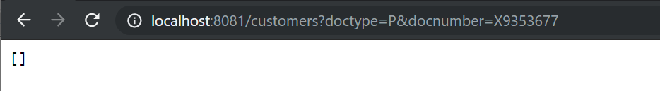
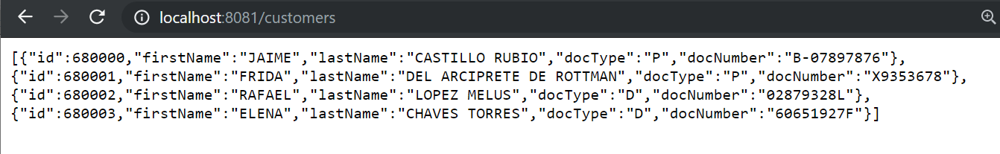
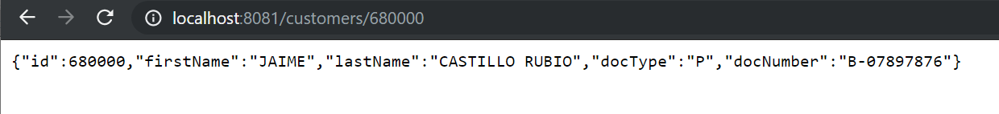

# Package and deploy Spring Boot Applications

## Introduction

The goal of this session is for attendees to have all the tools to start using Docker in their day to day work, for services deployment.
 
We have provided a virtual machine with Docker installed. If you are curious about the installation process, you can get a glimpse of the following link forehand:
 [How to install docker on ubuntu ](https://medium.com/@Grigorkh/how-to-install-docker-on-ubuntu-16-04-3f509070d29c)
 
**We kept the technical requirements to a minimum.** In our case we focused on having a minimal (VirtualBox) VM with Docker/Git working configuration. This will be enough to remove 80% of the blockers during the training sessions.


## Docker containers

### Current situation and motivation for Docker

Docker is currently a hot topic in container-based deployment, whereas Spring Boot is the same for microservice development. Both Spring Boot and Docker together form a great combo for developing microservice-based applications.


## Docker Introduction

### Docker features

Docker gives the user the capability to create their own Docker images and deploy them in Docker. To create your own Docker image, you have to create our own Dockerfile. Basically, a Dockerfile is a simple text file with all the instructions required to build the image.

     
### Docker scheme
     
// TO-DO
        
### Main components of Docker

// TO-DO
 
### Ways to deploy a Spring Boot Application.

Spring Boot applications can be deployed into production systems with several methods:

-   Deploying in Java Archive (JAR) as a standalone application.
-   Deploying in Docker Container.
-   Deploying as Web Application Archive (WAR) into a servlet container.
-   Deploying behind NGINX web server — direct setup,
-   Deploying behind NGINX web server — containerized setup.
-   .. Kubernetes ... Open Shift ... Cloud...

In this session, we will go through step by step deployment of Spring Boot applications via the first 2 methods.

## Spring Boot Maven plugin + Docker 

We have successfully created and run the application in the embedded server of the IDE, but now we will deploy it in a Docker container. For this, we have to create a Dockerfile that will contain the steps to be executed by Docker to create an image of this application and run that image from Docker.

### Pre-requisites: 

- RESTful Web Services, persistence and entity classes [session]([https://github.com/alberto-morales/microservices-java-training-course/blob/20191101-AcmeBankApplication/docs/Spring_Boot_data_JPA_PostgreSQL_REST_API.md](https://github.com/alberto-morales/microservices-java-training-course/blob/20191101-AcmeBankApplication/docs/Spring_Boot_data_JPA_PostgreSQL_REST_API.md)) finished.

-  A minimal (VirtualBox) VM with Docker/Git working configuration.

### Step 1: Deploying in Java Archive (JAR) as a standalone application

Spring Boot applications can easily be packaged into JAR files and deployed as standalone applications. 
First you set up a basic build script. You can use any build system you like when building apps with Spring, but the code you need to work with [Maven](https://maven.apache.org/) is included here. If you’re not familiar with Maven, refer to [Building Java Projects with Maven](https://spring.io/guides/gs/maven).
This is done by the  _spring-boot-maven-plugin_. The plugin is automatically added to pom.xml once the Spring project is created via  [Spring Initializr](https://start.spring.io/)  as a Maven project.

```xml
...
	<build>
		<plugins>
			<plugin>
				<groupId>org.springframework.boot</groupId>
				<artifactId>spring-boot-maven-plugin</artifactId>
			</plugin>
		</plugins>
	</build>

</project>

```
The  [Spring Boot Maven plugin](https://docs.spring.io/spring-boot/docs/current/maven-plugin)  provides many convenient features:

-   It collects all the jars on the classpath and builds a single, runnable "über-jar", which makes it more convenient to execute and transport your service.
    
-   It searches for the  `public static void main()`  method to flag as a runnable class.
    
-   It provides a built-in dependency resolver that sets the version number to match  [Spring Boot dependencies](https://github.com/spring-projects/spring-boot/blob/master/spring-boot-project/spring-boot-dependencies/pom.xml). You can override any version you wish, but it will default to Boot’s chosen set of versions.

Since 'jar' is the default packaging type it is not required to set it in this case.
```xml
<project>
   ...
  <!-- <packaging>jar</packaging>  -->
</project>
```
In order to package the application in a single (fat) jar file, run the maven command `mvn package` under project directory. This will package the application inside an executable jar file with all its dependencies

The 'package' phase is always responsible for bundling all the files in the artifact, in this case a JAR-file.
In your project's target directory you'll see the generated jar file which is named like: 'acme-bank-0.0.1-SNAPSHOT.jar'.
The resulting 'jar' file contains the compiled java class files as well as the files from src/main/resources.
To run the jar file, use the following standard JVM command `java -jar <jar-file-name>.jar` (in our case `java -jar acme-bank-0.0.1-SNAPSHOT.jar`).


### Step 2. Deploying in Docker Container
Once the setup of all requirements has been satisfied, a database that supports features for the ACME Bank application must be setup.

Before deploying the application into a Docker container, we will first package the application in a (fat) JAR file. This process is previously explained, therefore we will assume you have a jar file.

On the first step, we need to build a container image. For this, we start with creating a  `Dockerfile`  in the project root directory as follows:

```file
# latest oracle openjdk is the basis  
FROM openjdk:oracle# copy jar file into container image under app directory  

COPY target/acme-bank-0.0.1-SNAPSHOT.jar app/acme-bank.jar # expose server port accept connections  

EXPOSE 8081 # start application  

CMD ["java", "-jar", "app/acme-bank.jar"]
```
These are the four steps for that will create an image of our Java application to be able to run Docker.

Note that, in the above snippet, we assumed that the application JAR file `acme-bank-0.0.1-SNAPSHOT.jar`  is located under the target directory of our project. We also assumed that the embedded servlet port is 8081.

We can now build the Docker image with the following command (from where the Dockerfile is located):

docker image build . -t acme-bank:latest

where  `-t`  is the name and tag of the image to be built. Once the image is built, we can create and run the container via:

docker container run -p 8081:8081 -d --name acme-bank-container acme-bank

where  `-p`  publishes (maps) host port to container port (in this case both are 8081). The option  `-d`  (detach) runs the container in background, and  `--name`  specifies the name of the container.





The Spring Boot Application is running from the Docker container.

### Step 3. Dependencies

Before adding some persistence code to the project, first you have to add the required dependencies to `pom.xml`. Adding spring-boot-starter-data-jpa dependency to `pom.xml` is needed, and provides transitively Spring data, Hibernate, HikariCP and related dependencies.

```xml
		<dependency>
			<groupId>org.springframework.boot</groupId>
			<artifactId>spring-boot-starter-data-jpa</artifactId>
		</dependency>
```

We must add PostgreSQL database dependency too.

```xml
	<dependency>
		<groupId>org.postgresql</groupId>
		<artifactId>postgresql</artifactId>
	</dependency>
```

### Step 4. Persistent Entity
Using JPA, you can designate any POJO class as a JPA entity – a Java object whose nontransient fields should be persisted to a relational database. The JPA Entity is any Java POJO, which can represent the underlying table structure. As our service is based on the `card_holders` table, we will create a `CardHolder` Entity object, as the following listing (in `src / main / java / eu / albertomorales / training / acmebank / persistence / impl / CardHolderImpl.java`) shows:

```java
@Entity
@Table(name = "card_holders")
public class CardHolderImpl implements CardHolder {

    public CardHolderImpl() {
    }

    public CardHolderImpl(String firstName, String lastName, String docType, String docNumber) {
		super();
		this.firstName = firstName;
		this.lastName = lastName;
		this.docType = docType;
		this.docNumber = docNumber;
	}

	@Override
	public Long getId() {
		return id;
	}
	public void setId(Long id) {
		this.id = id;
	}
	@Override
	public String getFirstName() {
		return firstName;
	}
	public void setFirstName(String firstName) {
		this.firstName = firstName;
	}
...
...
	public void setDocNumber(String docNumber) {
		this.docNumber = docNumber;
	}
    
    @Id
    @GeneratedValue(strategy = GenerationType.AUTO)
    private Long id;
    @Column(name = "firstname")    
	private String firstName;
	
...
```
The above POJO is annotated with `@Entity`, which is to denote this is an entity object for the table name `card_holders`.

Then, there are five fields that represent the datable table columns. Field `id` is our Primary Key and, hence, marked as `@Id`.

The field id is also marked with `@GeneratedValue`, which denotes that this is an Auto-Increment column and Hibernate will take care of putting in the next value. Hibernate will first query the underlying table to know the max value of the column and increment it with next insert. This also means that we don't need to specify any value for the Id column and can leave it blank.

### Step 5. Repository interface
The Repository represents the DAO layer, which typically does all the database operations. Its very simple,  thanks to Spring Data, who provides the implementations for these methods. 

Declare an interface extending `CrudRepository` (subinterface of `Repository`) and type it to the domain class and ID type that it should handle.

```java
interface CardHolderRepository extends CrudREpository <CardHolder, Long> { … }.
```

And we have declared an aditional query method on the interface.

Let's have a look at our `CardHolderRepoisitory`:
```java
import org.springframework.data.repository.CrudRepository;
import org.springframework.data.jpa.repository.Query;
import org.springframework.data.repository.query.Param;

import eu.albertomorales.training.acmebank.persistence.impl.CardHolderImpl;

import java.util.List;

public interface CardHolderRepository extends CrudRepository<CardHolderImpl, Long> {

	@Query("SELECT c FROM CardHolderImpl c WHERE c.docType = :doc_type AND c.docNumber = :doc_number ")
	List<CardHolderImpl> findByDocument(@Param("doc_type") String docType, @Param("doc_number") String docNumber);
    
}
```

Here, we are done with the JPA and Spring data things — in other words, the DAO layer. 

One more thing, update the PostgreSQL and hibernate settings in application.properties

```properties
## PostgreSQL
spring.datasource.url=jdbc:postgresql://localhost:5432/acme_bank_products
spring.datasource.username=acme
spring.datasource.password=acme

# Show or not log for each sql query
spring.jpa.show-sql = true

# Allows Hibernate to generate SQL optimized for a particular DBMS
spring.jpa.properties.hibernate.dialect = org.hibernate.dialect.PostgreSQLDialect

spring.jpa.hibernate.naming.implicit-strategy=org.hibernate.boot.model.naming.ImplicitNamingStrategyLegacyJpaImpl
spring.jpa.hibernate.naming.physical-strategy=org.hibernate.boot.model.naming.PhysicalNamingStrategyStandardImpl
```
Let's now write a Controller.

### Step 6. CardHolder Controller
The `CardHolderController` is a standard REST controller with some simple endpoints. The job of the controller is to handle the HTTP requests. Of course a service layer is needed, and the controller should invoke the Service class methods.... However, that is a different matter, for today this is good enough.

```java
import org.springframework.beans.factory.annotation.Autowired;
import org.springframework.http.HttpStatus;
import org.springframework.stereotype.Controller;
import org.springframework.web.bind.annotation.RequestMapping;
import org.springframework.web.bind.annotation.RequestMethod;
import org.springframework.web.bind.annotation.RequestParam;
import org.springframework.web.bind.annotation.PathVariable;
import org.springframework.web.bind.annotation.ResponseBody;
import org.springframework.web.server.ResponseStatusException;

import java.util.List;
import java.util.Optional;
import java.util.ArrayList;

import eu.albertomorales.training.acmebank.persistence.CardHolder;
import eu.albertomorales.training.acmebank.persistence.impl.CardHolderImpl;
import eu.albertomorales.training.acmebank.persistence.CardHolderRepository;

@Controller
public class CardHolderController {
	
	@RequestMapping(value="/customers", method = RequestMethod.GET)
    @ResponseBody
    public List<CardHolder> getByDocument(@RequestParam(required = false, name="doctype") String typeDoc, @RequestParam(required = false, name="docnumber") String numberDoc) {
		Iterable<CardHolderImpl> customers = null;
		if (typeDoc != null || numberDoc != null) {
			customers = repository.findByDocument(typeDoc, numberDoc);
		} else {
			customers = repository.findAll();
		}
    	List<CardHolder> result = new ArrayList<CardHolder>();
    	customers.forEach(result::add);
    	return result;		
    }	
	
	@RequestMapping(value="/customers/{id}", method = RequestMethod.GET)
    @ResponseBody
    public CardHolder getById(@PathVariable Long id) {
    	Optional<CardHolderImpl> optCustomer = repository.findById(id);
    	if (optCustomer.isPresent()) {
    		return (CardHolder)optCustomer.get();
    	} else {
    		throw new ResponseStatusException(
  				  HttpStatus.NOT_FOUND, "Card holder not found."
  				);
    	}
    }		
	
	@Autowired
	private CardHolderRepository repository;	
```

Now, the RESTful Service is ready to run. Start the application and execute the HTTP endpoints — that's it.




	
## Summary

Congratulations! You have developed a Spring Boot application with a RESTful front end and a JPA-based back end.