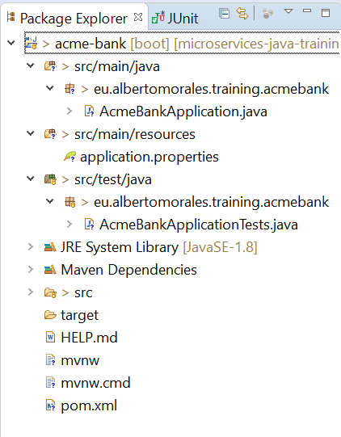

# RESTful  Web Services with Spring Boot

## Introduction

The goal of this session is to achieve full autonomy by installing and configuring Airflow with a standard and easy configuration 
(but effective for most projects), as well as learn the basic functionalities about workflows creation and getting familiar with 
Airflow web interface.

This introduction will explain the basics concepts of Airflow using a business case that will be developed during this session.

This case study is the creation of a pipeline that, using this dataset about High Speed train tickets, try to predict its price
and cluster the ticket belong (two models, one supervised and other unsupervised have been training before, and are available through
different endpoints).

1. Mocks user alarms for Renfe tickets. Those alarms are just a ticket scrapped in a very particular point of time we want to track.
2. Predicts future (next week price), and compare to original price.
3. Perform a clustering of ticket (just for learning purposes).

## Spring Boot: motivation, advantages and disadvantages

### Current situation and motivation for Spring Boot existance

Currently the management and orchestration of processes has been carried out using various tools and methodologies, for example:

* Shell scripts.
* Python scripts.
* R scripts.
* Jupyter Notebooks.
* Cron
* Oozie

At the same time, the Data practice has evolved due to:

* More data accumulated by companies. They want to use that data.
* Companies whose activity was not oriented to the storage and exploitation of the data from the beginning, but that 
    want to invest and transform into data-oriented organizations.
* Data accumulated in very heterogeneous sources (relational databases, Big Data infrastructure, cloud infrastructure).

All this causes an increasing complexity when working with data and designing processes for its exploitation:

* It is more complicated and critical to monitor (executions, failures).
* It is more complicated to find bugs and fix them (search the logs, etc.).
* It is more complicated to maintain the processes and introduce changes without affecting critical parts.

Apache Airflow has gained great popularity in the coming years, especially due to the rise of Data projects using Machine 
Learning libraries written in Python or whose main API is in Python, which is becoming the 
[reference language] (https://stackoverflow.blog/2017/09/06/incredible-growth-python/) in the field of data analysis 
and artificial intelligence (sorry R).

If programming languages were divided in terms of their efficiency and
[speed] (http://www.bioinformatics.org/benchmark/results.html) in execution, 
there would be 3 distinct groups:

1. Fast languages: C, C ++, Fortran.
2. Languages with intermediate speed: Java, Scala.
3. Slow languages: Python, Ruby, Perl.

Most of the code written in Python for scientific computing and data analysis, uses under the hood extensions 
in C or C ++ (as in the case of NumPy or Tensorflow). Python does a good job as a wrapper and nexus of
code written in other (faster) languages. At the same time, its learning curve is reduced compared to
other languages, so it attracts users with little experience in programming and software development, but with
solid knowledge about data analytics. Growth in recent years has been exponential.


## Spring Boot Introduction

### Spring Boot features

Python properties as a 'glue' language fit perfectly with the concept proposed by Apache Airflow, that is why its 
use has increased since its [release](https://airbnb.io/projects/airflow/) by the AirBnB engineering team.

Apache Airflow is defined as:

> A platform to programmatically author, schedule and monitor workflows.

The main features of Apache Airflow are the following:

* Usability
     * Web interface.
     * Creation and use of connections with diverse infrastructure.
     * Review of logs of each task independently.
     * Visualization of the executed code in each task.
* Robustness:
     * Task retry management.
     * Dependency between tasks.
* Elegant:
     * Definition of execution graphs (DAGs) as .py files
     * Minimum knowledge about scripting required.
     
### Spring Boot operating scheme
     
Airflow consists of 4 main components.

* Webserver:
     * Process monitoring and visualization.
     * Query execution logs.
     * Definition of 'connections'.
* Scheduler:
     * Launching tasks and processes at the right time and order.
* Metadata database:
     * Storage of the status of tasks and processes: queued, running, retrying, finished, failed.
     * Storage of connections, users, passwords, etc.
* Worker (optional):
     * This component is responsible for executing the tasks offering additional functionalities to the execution by 
     default. These additional functionalities usually have to do with the distribution of the execution.
        
### Main components of Spring Boot

The main components of Spring Boot are the following:

* DAG: Acronym for Directed Acyclic Graph: it is a set of tasks arranged according to a certain 
dependence between them and that are executed with a certain periodicity.
* Tasks: execution units.
* Operators: define the type of task. They are subdivided into three types:
    * Operators: execute some arbitrary action.
    * Transfers: move information between different locations.
    * Sensors: wait for changes in the system to start the execution.
 * Hooks: communication interfaces with the infrastructure.
 * Plugins: extensions of all the previous elements.
 
### Ways to create a Spring Boot project.

There is a big difference in the way processes are executed in Apache Airflow. The element that performs the execution 
of the end of tasks in Airflow is called executor. There are several types of executors, each with their strengths
and drawbacks:

* Sequential executor: is the default executor of Apache Airflow. It is characterized by executing tasks sequentially 
(without any parallelization). It is good for prototyping processes and developing.
* Local executor: uses Python built-in multiprocessing library. Its great advantage is that it does not require any 
external elements to work and supports parallelization of tasks in a local machine. It is a good option when airflow 
tasks needs some processing power and scheduler is on a single computer.
* [Celery](http://www.celeryproject.org/) executor: Celery is by definition a distributed task queue. Its
main feature is that it allows to distribute the tasks by several machines that are coordinated with the help of a 
broker like Redis or RabbitMQ.
* [Dask](https://dask.org/) executor: Dask has been one of the great revelations in the analytical community that allow 
to distribute Python natively. Its main feature is that beyond distributing tasks by certain components of a cluster, 
Dask distributes the tasks themselves, using distributed arrays of pandas and numpy. Please note the difference between
distributing tasks and distributed tasks.

## Spring Boot project 

### Pre-requisites: 

- JDK
Download the latest JDK from [here](http://www.oracle.com/technetwork/java/javase/downloads/index.html). 

- IDE (Eclipse)
We recommend to follow this [guide](https://www.eclipse.org/downloads/packages/installer)
that illustrates the use of Eclipse Installer (at the current time we use Eclipse Installer 2019-09 R)
!RESTful Web Services](./images/Eclipse-install-1.png)

### Step 1: Spring Tools for Eclipse IDE installation

You can install the Spring Tools for Eclipse IDE into an existing Eclipse installation using the Eclipse Marketplace. Just open the marketplace client in Eclipse, search for Spring Tools and install the “Spring Tools (aka Spring IDE and Spring Tool Suite)” entry.


### Step 2. Java project setup

Once the setup of all requirements has been satisfied, a java project for the Spring Boot application must be setup.

Let's start: 

First, from the File menu select "New"  and then "other" and from wizard expand "Spring Boot" and select ‘Spring Starter Project’ (File->New->other->wizard->Spring Starter Project)

Select next and provide the below information 


and click the Finish button.


Now you can see the below file structure in your project's explorer window.



Have a look that the AcmeBankApplication.java file which is created by the STS plug-ins.


This is a Spring Boot main class. A Spring Boot REST application loads through this class. We can also see that this class is created with the annotation `@SpringBootApplication`. As per the Spring documentation, the annotation `@SpringBootApplication` is equivalent to using `@Configuration`, `@EnableAutoConfiguration`, and `@ComponentScan`, and these annotations are frequently used together. Most of the time in Spring Boot development, the main class is always annotated with all three of these important annotations.

So we are going to modify the @SpringBootApplication anotation with a component path. Without that, the application cannot find out the controller classes. We will learn more about controller classes in a few minutes.

```java
@SpringBootApplication(scanBasePackages = {"eu.albertomorales.training.acmebank"})

public class AcmeBankApplication {
	public static void main(String[] args) {
		SpringApplication.run(AcmeBankApplication.class, args);
	}
}
```
To model the pong representation, we are going to create a resource representation class here.

First, we will create package, `com.albertomorales.training.acmebank.dto`, and add the class into that package like below:

* Right-click on the project and select New and then package. Enter the above package name and click Finish.


* Now, right click on the package `com.albertomorales.training.acmebank.dto` and select New->class and provide the class name, `Pong`, like below:


In the empty class, just copy and paste the below code:

```java
package eu.albertomorales.training.acmebank.dto;

public class Pong {

	public Pong(String message) {
		super();
		this.message = message;
	}

	public String getMessage() {
		return message;
	}
	
	private final String message;

}
```
So the above `Pong` class is a resource representation class for a pong message. Spring uses the Jackson JSON library to automatically marshal instances of type `Pong` into JSON.

Now we will introduce a controller and that will serve `Pong`. In Spring’s approach to building RESTful web services, HTTP requests are handled by a controller. Controller `classes/components` are easily identified by the `@RestController` annotation, and the below PongController will handle GET requests for `/pong/user` by returning a new instance of the `Pong` class.

Now just follow next steps: create the package `eu.albertomorales.training.acmebank.controller`, add the class `PongController` to it and import the class `Pong`.

```java
package eu.albertomorales.training.acmebank.controller;

import eu.albertomorales.training.acmebank.dto.Pong;
import org.springframework.stereotype.Controller;
import org.springframework.web.bind.annotation.GetMapping;
import org.springframework.web.bind.annotation.RequestParam;
import org.springframework.web.bind.annotation.ResponseBody;

@Controller

public class PongController {
	
private static final String welcomemsg = "Pong Mr. %s!";

    @GetMapping("/pong/user")
    @ResponseBody
    public Pong pongUser(@RequestParam(name="name", required=false, defaultValue="Trainee") String name) {
        return new Pong(String.format(welcomemsg, name));
    }
}
```
The `@RequestMapping` annotation maps all HTTP operations by default and, in this example, it ensures that HTTP requests to `/pong/user` are mapped to the `pongUser()` method.

Now we are done with everything for a GET RESTful call. Let’s test this application first. After the test, we will learn about POST calls as well.

To compile this project with Maven, we will add the below information into the POM file:

```xml
		<dependency>
		    <groupId>org.springframework</groupId>
		    <artifactId>spring-web</artifactId>
		</dependency>
		
		<dependency>
		    <groupId>org.springframework.boot</groupId>
		    <artifactId>spring-boot-starter-web</artifactId>
		</dependency>
```
And we'll also add the below information for the property (initially to change the port number) file. 
So search for `\src\main\resources\application.properties` file and add the below lines to it.

```properties
server.port=8083 
spring.profiles.active=@spring.profiles.active@ 
```

Note: normally with Maven, you have to  have these lines in the <build> tag.

```xml
        <resources>
            <resource>
                <directory>src/main/resources</directory>
                <filtering>true</filtering>
            </resource>
        </resources>
```

But you do not need this here because Spring Boot will take care it.

Then run this to start. You should see something like this:


Once the server starts successfully, open your browser and put the below URL in the address bar and press enter.

`http://localhost:8081/pong/user?name=Rafa`

 Now you can see the below information:


	
## Bibliography


RESTful Web Services is a 2007 book by Leonard Richardson and Sam Ruby. It was the first book-length treatment of RESTful design, and the predecessor to RESTful Web APIs. RESTful Web APIs (2013) was designed as a complete replacement for RESTful Web Services.
